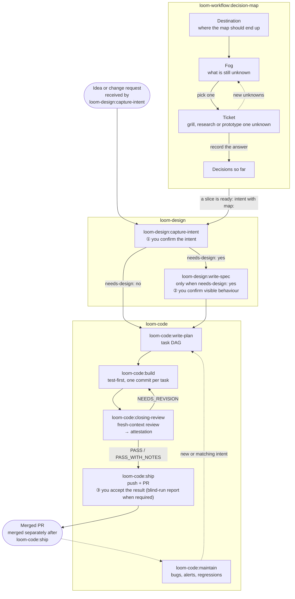

# Loom

Loom carries one change from a rough idea to a merged pull request, with
machines verifying machines along the way. Agents write the intent, spec,
plan and code; fresh-context agents that did not write them review, blind-run
and attack the result; a deterministic checker recomputes the evidence before
anything is published. You are asked only three times: to confirm what the
change is, to confirm visible product behaviour when there is any, and to
accept the result, through the blind-run report when one is required.

Loom ships as three independently installable plugins for Claude Code,
Codex and Antigravity CLI:

| Plugin | Version | Skills | Role in the flow |
| --- | --- | --- | --- |
| [`loom-design`](loom-design/) | 2.1.5 | 5 | Front of the flow: intent, specification, product principles, visual design. |
| [`loom-code`](loom-code/) | 3.1.4 | 6 | Engineering stations: plan, build, closing-review, ship, maintain. |
| [`loom-workflow`](loom-workflow/) | 4.3.4 | 12 | Tools around the stations: memory, critique, recap, handoff, second opinions (`independent-advisor`). |

Each plugin keeps its own manifest, version, tests and changelog; its README
covers usage in depth.

## The Loom flow



- **① Intent** — `capture-intent` restates the change in your words, with
  testable acceptance lines, and waits for your yes. Without `loom-design`
  installed, `loom-code:write-plan` captures the intent itself.
- **② Specification** — `write-spec` runs only for changes that need design;
  for product changes you confirm the visible behaviour before planning.
- **Build and review** — `build` implements each planned task test-first.
  `closing-review` then dispatches the checker-computed number of fresh-context
  reviewers (two unless the change is narrow and low-risk), a blind runner
  when an acceptance line cannot be checked mechanically, and adversarial
  programs for code, skill, spec or gate changes. Passing evidence becomes an
  attestation bound to the reviewed content.
- **③ Acceptance** — `ship` pushes the branch, opens the PR and verifies
  checks; you accept the change, through the blind-run report when one was
  required.
- **Maintain** — `maintain` attaches an incident to a matching open intent, or
  creates one, and hands it to `write-plan`.
- **Decision map** — the second way into `capture-intent`: when a slice of a
  long-running map is ready, `decision-map` writes an intent carrying `map:`.

### Where loom-workflow plugs in

`loom-workflow` tools are not stations; they attach to the flow at specific
points or run on demand.

| Tool | When it is used in the flow | What it does |
| --- | --- | --- |
| `decision-map` | Before the flow: writes the intent that starts a change | Keeps a long-running Outcome Map and turns a ready slice into an intent. |
| `git-memory` | Before every commit at any station (intent, plan, build, attestation); at `ship` when the PR is created; and before the PR is merged, which happens after `ship` | Classifies decision, learning and gotcha memory for commits and the PR body. |
| `loom-memory` | Before the branch closes, when a lesson is worth keeping (on request or by agent judgment; no station calls it) | Records a durable lesson the branch taught in the repository memory store. |
| `independent-advisor`, `handoff`, `recap-state` | On demand, not tied to a station | Second opinions, cross-session handoff and in-session recaps. |

`decision-map` is for work whose whole route cannot be listed up front; its
loop is the `loom-workflow:decision-map` group in the flow diagram above.
The map, called an Outcome Map, lives at `docs/loom/maps/<map-id>/` as
`MAP.md` plus a `tickets/` directory and persists across sessions. An unknown
becomes a ticket only once or is moved out of scope, and a grilling ticket hands
its discussion to `loom-design:capture-intent` when that plugin is installed.
The intent goes to `loom-design:capture-intent` (or `loom-code:write-plan`
without loom-design), which owns the delivered change while the map only reads
its status; the map is clear once every Destination acceptance criterion is
satisfied, fog is empty, and every ticket is closed or withdrawn.

## loom-design

Version 2.1.5. Turns a rough idea into a confirmed intent and a risk-declared
spec, and provides product-definition tools. Requires `loom-code`, whose
contract package it reads.

| Skill | Role |
| --- | --- |
| `capture-intent` | Interview, write and confirm a change intent (decision point ①). |
| `write-spec` | Write a design spec from a confirmed `needs-design: yes` intent (decision point ②). |
| `product-principles` | Ratify `PRINCIPLES.md`, the rules that govern product and engineering trade-offs. |
| `design-system` | Ratify a visual `DESIGN.md`: colour, type, layout and component tokens. |
| `using-loom-design` | Optional router to the right product-definition skill. |

## loom-code

Version 3.1.4. Five stations carry one change from plan to PR with
content-bound verification, one closing review and a fast publication gate.

| Skill | Role |
| --- | --- |
| `write-plan` | Turn a confirmed intent into a task DAG with tests and risks per task. |
| `build` | Implement the plan test-first, one task at a time. |
| `closing-review` | Run the closing review (read, blind run, adversary) and generate an attestation. |
| `ship` | Publish the reviewed branch, open the PR and verify checks (decision point ③). |
| `maintain` | Attach bug reports, alerts, regressions or incidents to a matching open intent, or create one, and hand it to write-plan. |
| `using-loom-code` | Optional router to the right station. |

It also ships the `implementer`, `reviewer`, `blind-runner` and `adversary`
agents that the stations dispatch.

## loom-workflow

Version 4.3.4. Workflow tools used around the stations; all work without
`loom-code`; only `decision-map`'s delivery step, which writes an intent,
needs it. See
[Where loom-workflow plugs in](#where-loom-workflow-plugs-in) for how they
attach to the flow.

| Skill | Role |
| --- | --- |
| `loom-memory` | Recall, record, reconcile or retire durable repository lessons. |
| `git-memory` | Classify commit and PR memory before committing; recall why a past decision was made. |
| `critique` | Judge a proposal or look for a simpler version of a change. |
| `decision-map` | Chart or advance a persistent Outcome Map across sessions. |
| `independent-advisor` | Get a second opinion from another model, effort level or vendor. |
| `recap-state` | In-session recap of where the work stands. |
| `handoff` | Save or resume state across sessions. |
| `distill-sessions` | Mine past Claude Code or Codex sessions for skill improvement proposals. |
| `cot-explain` | Explain documented reasoning as a page with a chain-of-thought diagram. |
| `goal-create` | Create a session goal or draft a repository purpose (invoked by name only). |
| `dbt-model-style` | Apply dbt and Redshift style when writing or reviewing a dbt SQL model. |
| `using-loom-workflow` | Optional router to the right workflow tool. |

## Install

For Claude Code and Codex, this repository is a plugin marketplace named
`loom`.

### Claude Code

```sh
claude plugin marketplace add https://github.com/kouko/loom-plugins.git
claude plugin install loom-code@loom
claude plugin install loom-design@loom
claude plugin install loom-workflow@loom
```

The plugins are independently installable: install only the ones you need.
`loom-code` needs neither sibling; `loom-design` requires `loom-code`. Plugins
compose only through plugin-qualified skill names such as
`loom-design:write-spec`, the contract package and the project's own
`docs/loom/` artifacts.

### Codex

```sh
codex plugin marketplace add https://github.com/kouko/loom-plugins.git
codex plugin add loom-code@loom
codex plugin add loom-design@loom
codex plugin add loom-workflow@loom
codex plugin list
```

### Antigravity CLI

Antigravity CLI (`agy`) installs plugins from a local directory, so clone the
repository and install each plugin from the clone. Install `loom-code` first:
the other two use its contract package and checker.

```sh
git clone https://github.com/kouko/loom-plugins.git
cd loom-plugins
agy plugin install ./loom-code
agy plugin install ./loom-design
agy plugin install ./loom-workflow
agy plugin list
```

`agy plugin validate ./loom-code` (or any other plugin directory) checks a
plugin before you install it. To update, run `git pull` in the clone and run
the install commands again; each install replaces the installed copy. To
remove a plugin, run `agy plugin uninstall <name>`, for example
`agy plugin uninstall loom-workflow`.

To use loom, start `agy` from your project with the project added as a
workspace by absolute path: `agy --add-dir "$PWD"` (interactive) or
`agy --add-dir "$PWD" -p "..."` (print mode); agy 1.2.2 does not honour a
relative path such as `.`. Without `--add-dir`, print mode (`agy -p`)
attaches no workspace, so loom's kickoff defaults are not loaded and the
agent may act outside the project; pass it in interactive mode too.

Limits on Antigravity:

- The plugin hooks (the push gate, the session context, the language reminder
  and the skill-folder rule) run only in the `agy` CLI, not in the Antigravity
  desktop app or IDE, so those gates are not enforced there.
- loom's roles (implementer, reviewer, adversary, blind-runner) run as agy
  `self` subagents that follow loom's agent contracts, on Gemini models.
- The review station is `closing-review` on every host; the old `review` name
  was removed and has no alias.

## Development

From the repository root, run the complete existing package inventory in an
isolated environment:

```sh
uv run --isolated --with-requirements requirements-package-tests.lock python scripts/run_package_tests.py --loom-family -q
```

CI selects the code, design, workflow-python and workflow-shell groups from
that same inventory. The shared manifest check is scoped to these three plugins:

```sh
python3 scripts/sync_codex_manifests.py --check --all
python3 scripts/check_plugin_boundaries.py loom-code
python3 scripts/check_plugin_boundaries.py loom-design
python3 loom-code/scripts/check-skill-crossrefs.py
```

The marketplace at `.claude-plugin/marketplace.json` contains only these three
plugin roots. Homepage and repository URLs inside plugin manifests still point
to the historical origin repository.

## Migration provenance

This repository was extracted from a fixed `monkey-skills` commit.
`docs/migration/extraction.json` records that commit, the reviewed path boundary
and verification counts. `docs/migration/commit-map.tsv` maps every original
commit reachable from that source to its rewritten commit, or a zero SHA when
the commit did not touch a retained path. The original filter-repo map is also
preserved as `docs/migration/filter-repo-commit-map.tsv`.

Currently committed tests also cite four development commits outside main's
ancestry, and the measurement gate cites one otherwise empty snapshot boundary
within main's ancestry. `docs/migration/auxiliary-history.json` enumerates those exact tips and
their retained citation paths. Their required ancestry is filtered under
`refs/tags/loom-evidence/<original-sha>` tags and included in the complete
map. Default clones transport these tags without a custom fetch refspec.
This preserves main history plus currently referenced Loom development
evidence; it does not import every abandoned branch.

Historical predecessor plugin directories remain in Git history. Current
development uses only the three plugin directories above. Rewriting changes
commit IDs and invalidates historical signatures; author and committer identity,
dates, messages and retained file trees are verified against the original.

## License

MIT. See [LICENSE](LICENSE).
