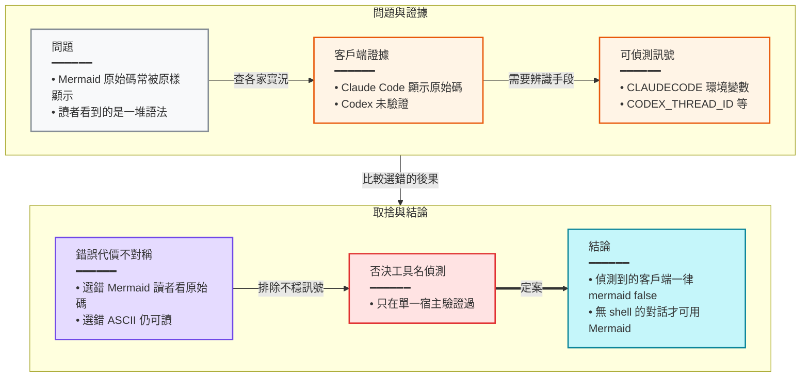

### 概述

在任何能被環境變數辨識出來的客戶端裡，聊天圖表一律用表格加 ASCII，Mermaid 只留給沒有 shell 的 claude.ai 或 Claude Desktop 對話。

### 推理鏈

#### 客戶端判斷規則怎麼來的

規格裡「客戶端判斷」這一條設計決定背後的推理。

##### A — 問題

- **主張**：在程式助手的聊天裡，Mermaid 常常顯示成原始碼。
- **依據**：規格的現況描述指出終端機會原樣顯示 Mermaid。
- **這一步改變了什麼**：確定「看起來漂亮」不能當選擇依據。

##### B — 客戶端證據

- **主張**：Claude Code 各介面顯示原始碼，Codex 未經驗證。
- **依據**：規格引用的客戶端能力對照表。
- **這一步改變了什麼**：沒有一個可偵測的客戶端被確認能渲染。

##### C — 可偵測訊號

- **主張**：可以用環境變數分辨 Claude Code、Codex、Gemini CLI。
- **依據**：規格列出的偵測規則。
- **這一步改變了什麼**：判斷可以交給腳本，而不是模型的感覺。

##### D — 錯誤代價不對稱

- **主張**：選錯 Mermaid 的代價比選錯 ASCII 大。
- **依據**：規格原文的理由。
- **這一步改變了什麼**：預設往保守的一側倒。

> a wrong Mermaid choice shows the user raw source, a wrong ASCII choice still reads

##### E — 否決工具名偵測

- **主張**：不用可用工具名稱當主要訊號。
- **依據**：規格的替代方案一節：只在一個宿主上驗證過。
- **這一步改變了什麼**：只保留在無 shell 對話這一種情況。

##### F — 結論

- **主張**：偵測得到的客戶端一律不用 Mermaid。
- **依據**：前面五步合起來。
- **這一步改變了什麼**：技能的預設形式是表格加 ASCII。

> `mermaid` is `false` for every environment-detected client in this change, because each is documented or reported to show Mermaid source raw, or is unverified.

### 岔路

| 考慮過的選項 | 否決理由 |
|---|---|
| 從可用工具名稱判斷客戶端 | 只在一個宿主驗證過 |
| 允許 Codex IDE 擴充用 Mermaid | 只有一則使用者回報，且環境上分不出 CLI |

---

本頁是規格中一條設計決定的推理整理；要照做的人請以規格原文為準。
