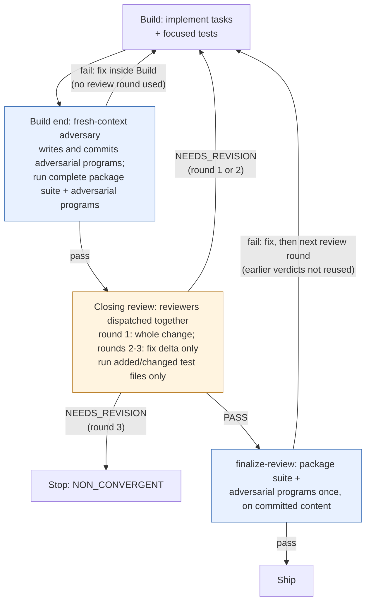

# Run every mechanical check before closing reviewers read the change
originator: kouko
kind: engineering
needs-design: no — this reorders existing Build and closing-review steps in station and agent prose; it touches no configured interface surface, and the review-round states it relies on are already defined by the closing-review contract
status: confirmed 2026-09-15
publication: automatic — authorized 2026-09-15 by kouko

## Problem
Closing review is slow. Across the 40 most recent `loom-code:reviewer` runs the
median active time is 4.1 minutes, and 32 of 40 reviewers re-ran the complete
package suite themselves; suite execution is 65% of reviewer command time.
With two reviewers per change, one review round runs the suite up to three
times (each reviewer, then `finalize-review`), and every fix round repeats it.
Meanwhile adversarial programs are written during closing review with no rule
on when they land relative to reviewers, so a mechanical failure can surface
only after two reviewers have already spent a round of judgment on content
that was broken.

The maintainer who waits on each change pays this time on every loom change
in this repository.

## Proposed outcome
All mechanical checks — the complete package suite and the adversarial
programs — have run and passed before any closing reviewer is dispatched.
Reviewers spend their time on judgment and only run the tests the change
added or changed, never the complete suite or the adversarial programs.
`finalize-review` stays the single content-bound execution that produces
the attestation, and every fix loop re-runs the mechanical checks before the
next review round.

Illustrative flow of the wanted state (the Acceptance lines below are the
contract; this sketch does not add requirements):

Blue steps are mechanical checks; the orange step is reviewer judgment. A
closing-review episode still reviews at most three content versions; a fix
that would need a fourth ends the episode.

## Acceptance
1. After all Build tasks land, the Build station dispatches a fresh-context adversary that did not implement the change, has it write and commit its adversarial programs, then runs the complete package suite and those programs; a failure is fixed inside Build and does not reach closing review.
2. No Build station text still forbids running the complete package suite at the end of Build.
3. The closing-review station no longer dispatches the adversary, and it dispatches reviewers only for content whose Build mechanical checks passed.
4. No reviewer contract or review lens text still tells a reviewer to run the complete package suite or the adversarial programs, or to downgrade a dimension because it did not run them; the reviewer contract tells reviewers to run the added or changed test files and to raise a finding when one of those tests is skipped or does not run.
5. A reviewer-requested fix returns to Build and repeats Build's mechanical checks, re-running the existing adversarial programs, before the next review round.
6. After `finalize-review` fails, the fix must pass the next review round before `finalize-review` runs again; earlier verdicts are not reused for the fixed content.
7. `finalize-review` still executes the complete package suite and the adversarial programs once on committed content, and its existing checker tests pass unchanged.
8. A fresh agent given only the updated reviewer contract and a sample review task completes the review without running the complete package suite or any adversarial program.
9. This change's own closing review shows no reviewer running the complete package suite or an adversarial program.
10. The repository's package test suite passes, and the mechanism check against the trunk reports no net increase in counted mechanisms.

## Constraints
- No change to the checker code for `finalize-review`, attestation validation, or push validation.
- The reviewer floor, fresh-context reviewer independence, writer-not-judge separation, and checker-executed, content-bound evidence stay as they are.
- The closing-review limit of three reviewed content versions per episode and its stuck and non-convergent rules stay as they are.

## Out of scope
- A checker-run, content-bound mechanical result produced before review and reused by `finalize-review`.
- Dispatching an adversary before each implementer task.
- Changing reviewer count, reviewer model or effort, or how reviewers read files.
- Restoring the missing attack-catalogue reference that the adversary contract still cites.
- Releasing new plugin versions to the marketplace cache.

## Open questions
- none
