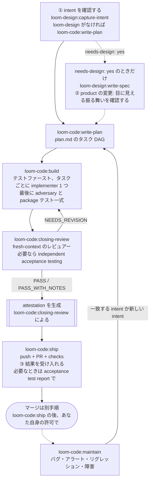

# loom-code

> **5 つのステーションが一つの変更を確認済みの intent から公開済みの
> pull request まで運び、何かがマシンの外に出る前に決定的な checker が
> 証拠を再計算します。** loom-code が前提にするのは基本的なソフトウェア工学の
> 知識であって、この plugin の知識ではありません。1 変更につき質問は最大 3 つ、
> 残りは理由を記録した上で自分で決めます。品質の出どころは機械が機械を
> 検査することです — 書く agent がレビューする agent になることは決して
> ありません。

**バージョン**: 3.13.0 · **Skills**: 5 ステーション + 1 ルーター + 1 ユーザー起動 · [CHANGELOG.md](CHANGELOG.md)
**言語**: [English](README.md) | [日本語](README.ja.md) | [繁體中文](README.zh-TW.md)
**リポジトリ**: [kouko/loom-plugins](https://github.com/kouko/loom-plugins)

---

## 変更の流れ



- **Intent** — `loom-design` を入れている場合は `capture-intent` が intent を
  確認し（①）、入れていない場合は `write-plan` が変更を言い直して ① を自分で
  訊きます。
- **仕様** — ② を訊くのは product の変更だけで、訊くのは spec を書いた側です：
  `loom-design:write-spec`、または code のみのインストールでは `write-plan` の
  最小 spec。
- **ビルドとレビュー** — `build` は全タスクに implementer を割り当て、テストから
  書き、最後に独立した adversary の敵対プログラムと package テスト一式を
  走らせます。これらが通るまで引き渡しません。`closing-review` はその確認済みの
  内容にクロージングレビューを 1 回行います。`NEEDS_REVISION` は
  指摘を `build` に戻し、合格した証拠は、レビューされた機能内容に結び付く
  attestation として生成されます。
- **Ship** — ブランチを push し、PR を開き、必須チェックを確認します（③）。
  Ship はマージしません。マージは、あなた自身の明示的な許可が要る別の手順です。
- **Maintain** — 進行中の未マージ変更の外で起きたバグ報告・アラート・
  リグレッション・障害を、一致する open な intent に結び付けるか新しい
  intent を作り、`write-plan` に渡します。

## Skills

| Skill | 役割 |
|---|---|
| [`write-plan`](skills/write-plan/SKILL.md) | 確認済みの intent を `docs/loom/<change-id>/plan.md` に変える：ファイル、担当する Acceptance 行、テストケース、リスクを持つ wave 分けされたタスク。`loom-design` がなければ ① を自分で行う。 |
| [`build`](skills/build/SKILL.md) | タスクごとに implementer を 1 つ割り当て、テストファーストで plan を実装し、最後に adversary と package テスト一式を走らせる。これらが通るまで引き渡さない。 |
| [`closing-review`](skills/closing-review/SKILL.md) | Build の確認を通った内容にクロージングレビュー（レビュアー、必要に応じて acceptance testing）を行い、`docs/loom/<change-id>/attestation.json` を生成する。 |
| [`ship`](skills/ship/SKILL.md) | attestation を検証し、push し、PR を開き、必須チェックを確認する（決定点 ③）。マージはしない。 |
| [`maintain`](skills/maintain/SKILL.md) | 進行中の未マージ変更の外で起きた障害を再現し、一致する open な intent に結び付けるか新しく作り、`write-plan` に渡す。 |
| [`using-loom-code`](skills/using-loom-code/SKILL.md) | 一般的な Loom の依頼に合うステーションを選ぶ任意のルーター。各ステーションは引き続き直接呼び出せる。 |
| [`expert-mode`](skills/expert-mode/SKILL.md) | ユーザーが明示的に呼び出す場合のみ：1 つの変更で実行・スキップする Loom ステップを選ぶ。入力された確認でのみ確定する。 |

## Agents

ステーションが次の agent を派遣します。自分の成果物をレビューする agent は
いません。

| Agent | 派遣元 | 役割 |
|---|---|---|
| [`implementer`](agents/implementer.md) | `build` | 1 タスク：失敗するテストを先に書き、1 コミット、状態レポート — verdict は出さない。 |
| [`reviewer`](agents/reviewer.md) | `closing-review` | fresh-context の verdict（`PASS` / `PASS_WITH_NOTES` / `NEEDS_REVISION`）と位置付きの指摘。レビュー対象は編集しない。 |
| [`acceptance-tester`](agents/acceptance-tester.md) | `closing-review` | クリーンな環境で変更を動かして全 Acceptance 行を確かめ、`docs/loom/<change-id>/acceptance-test-report.md` を書く。 |
| [`adversary`](agents/adversary.md) | `build` | 変更を壊しにいく — mutation や fuzz ツール、または実行可能な悪用・境界ケース — そしてすべての試行を probe として記録する。 |

レビュアーの人数は agent が選ぶのではありません。`loom_checker.py
reviewer-count` がブランチ全体の差分から計算します — 狭く低リスクな変更なら
1 人、それ以外や判定できないときは 2 人です。acceptance testing が行われるのは、Acceptance
行を機械的に判定できないときだけです。

## 訊かれる 3 つの質問

これ以外はすべて理由を記録した上で自動的に決まります。

1. **これがやりたいことですか？** — コードが存在する前に、意図を平易な
   言葉で言い直したもの。
2. **X と打つと Y が見える。合っていますか？** — 目に見える振る舞い。
   product の変更でのみ訊かれ、engineering では訊かれません。
3. **できましたか？** — 結果を受け入れます。acceptance test report が必要だった場合は、
   その変更に一切触れていない agent が書いたレポートを読みます。

不可逆な分岐（データの削除、公開インターフェース、片道のマイグレーション）は、
engineering の変更なら ①、product の変更なら ② に、結果の形で足されます —
余分な停止点は増やしません。

## contract package

`contract/manifest.yaml` がステーション、ツール、アクション、そしてすべての
artifact — intent・spec・plan・attestation・acceptance test report・`KICKOFF-DEFAULTS.md` —
の charter とフィールド、さらに standing document を宣言します。空のひな型は
`contract/templates/` にあります。書き込むのは loom-code のみ。`loom-design` は
これを読み `requires-contract` を宣言します。`loom-workflow` はそうではなく
——配信（delivery）の前に `decision-map` skill だけが `contract --require` を
実行します。

## checker

`scripts/loom_checker.py` が決定的な層です。どのルールも宣言を信じずに
リポジトリから再計算し、ルール一覧は `--list-rules` が正です。終了コードは
合格で 0、ルールによるブロックで 1、使い方や内部のエラーで 2 — 判定できない
checker が「問題なし」と言うことはありません。ステーションは intake、
`reviewer-count`、`finalize-review` でこれを呼びます。`finalize-review` は
コミット済みの内容で package テストと敵対プログラムを再度走らせ、内容に結び付く attestation を
生成します。インストール済みの `PreToolUse` hook は `git push` と
`gh pr create` の前にもう一度走り、内容の digest を再計算して、テストや probe を
再実行せずにその証拠を検証します。

## loom-design・loom-workflow との組み合わせ

3 つの plugin は独立してインストール可能です。loom-code は `loom-design` も
`loom-workflow` も必要とせず、任意の受け渡し先が不在のときは、その受け渡しを
理由付きで N/A と報告し、自分の契約が許す範囲で続行します。

- **loom-design** は `write-plan` の上流に `capture-intent` と `write-spec` を
  足します。入れていない場合は `write-plan` が intent の確認と最小 spec の
  作成を自分で行います。
- **loom-workflow** はステーションの周りにツールを足します。たとえば
  `loom-workflow:git-memory` は、`ship` が PR 本文の memory を分類するのに
  使います。

接続点は `loom-design:write-spec` のような plugin 名付き skill 名、contract
package、そしてプロジェクト自身の `docs/loom/` 成果物だけで、他 plugin の
`hooks/`・`skills/`・`scripts/` を直接読むことはありません。

## インストール

このリポジトリは `loom` という名前の plugin marketplace です。

### Claude Code

```bash
claude plugin marketplace add https://github.com/kouko/loom-plugins.git
claude plugin install loom-code@loom
```

`loom-design` と `loom-workflow` も同じ手順で入ります。

### Codex

```bash
codex plugin marketplace add https://github.com/kouko/loom-plugins.git
codex plugin add loom-code@loom
codex plugin list
```

インストール済みの `PreToolUse` hook が公開操作の割り込みを担います。導入先の
repo に checker のコピー、複製した contract、trust ledger は要りません。

安全に更新するには、次の順序で実行します。

```bash
codex plugin marketplace upgrade loom
codex plugin add loom-code@loom
codex plugin list
```

`plugin add` はインストール済み version の cache を置き換えるため、動作中の
task が保持している version 付き hook path を削除する場合があります。成功後は、
別の tool や command を実行する前に Codex を直ちに再起動してください。先に
plugin を削除しても、同じ path 不在期間が早く始まるだけなので行いません。

### Antigravity CLI

Antigravity CLI（`agy`）はローカルのディレクトリから plugin をインストール
します。repo を clone し、`loom-code` を兄弟 plugin より先に入れます。
インストール前に `agy plugin list` で Claude Code から取り込まれた同名の plugin が
ないか確認してください。install はその取り込み済みのコピーを置き換え、後の
`agy plugin uninstall` はそれを削除します。

```bash
git clone https://github.com/kouko/loom-plugins.git
cd loom-plugins
agy plugin validate ./loom-code
agy plugin install ./loom-code
agy plugin list
```

使うときは、プロジェクトのディレクトリでプロジェクトを絶対パスで workspace に追加して
`agy` を起動します：`agy --add-dir "$PWD"`（対話）または
`agy --add-dir "$PWD" -p "..."`（print モード）。agy 1.2.2 は `.` のような相対パスを
受け付けません。`--add-dir` がないと print モード（`agy -p`）では agy は workspace を
持たないため、loom の kickoff defaults が読み込まれず、agent がプロジェクトの外で
作業することがあります。対話モードでも指定してください。

更新は clone で `git pull` してから install を再実行します（install は
インストール済みのコピーを置き換えます）。削除は `agy plugin uninstall loom-code`
です。hook（公開リマインダー・session context・言語リマインダー）が走るのは `agy` CLI だけで、
Antigravity のデスクトップアプリや IDE では走りません。`agy` 上では loom の役割
（implementer・reviewer・adversary・acceptance-tester）は、loom の agent 契約に従う
agy の `self` subagent として Gemini モデルで動きます。review station は
どの host でも `closing-review` で、旧名 `review` は別名なしで削除されました。

## ライセンス

MIT。loom-code は `monkey-skills` で開発され、現在は
[kouko/loom-plugins](https://github.com/kouko/loom-plugins) にあります。
