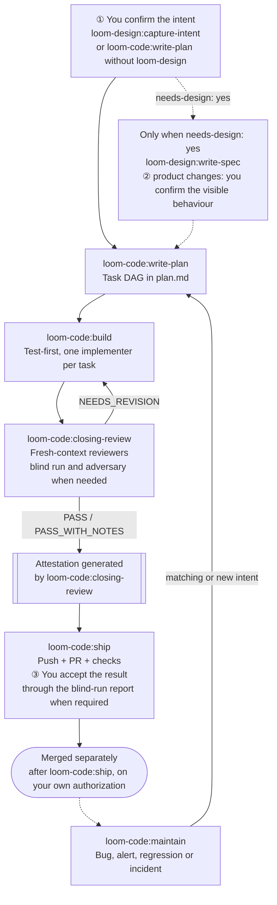

# loom-code

> **Five stations carry one change from a confirmed intent to a published
> pull request, and a deterministic checker recomputes the evidence before
> anything leaves the machine.** loom-code assumes you know basic software
> engineering, not this plugin: it asks you at most three questions per
> change and decides the rest itself, with the reason recorded. Quality comes
> from machines checking machines — the agent that writes is never the agent
> that reviews.

**Version**: 3.1.4 · **Skills**: 5 stations + 1 router · [CHANGELOG.md](CHANGELOG.md)
**Languages**: [English](README.md) | [日本語](README.ja.md) | [繁體中文](README.zh-TW.md)
**Repository**: [kouko/loom-plugins](https://github.com/kouko/loom-plugins)

---

## How a change flows



- **Intent** — with `loom-design` installed, `capture-intent` confirms the
  intent (①); without it, `write-plan` restates the change and asks ① itself.
- **Specification** — only a product change asks ②, at whoever writes the
  spec: `loom-design:write-spec`, or `write-plan`'s minimal spec on a
  code-only install.
- **Build and review** — `build` dispatches an implementer for every task,
  test first. `closing-review` runs one closing review; `NEEDS_REVISION` returns the
  findings to `build`, and passing evidence becomes a generated attestation
  bound to the reviewed functional content.
- **Ship** — pushes the branch, opens the PR and verifies required checks
  (③). Ship never merges: merging is a separate step that needs your own
  explicit authorization.
- **Maintain** — outside an active unmerged change, a bug report, alert,
  regression or incident is attached to a matching open intent, or a new one
  is created, and handed to `write-plan`.

## Skills

| Skill | Role |
|---|---|
| [`write-plan`](skills/write-plan/SKILL.md) | Turn a confirmed intent into `docs/loom/<change-id>/plan.md`: waved tasks with files, owned Acceptance lines, test cases and risk. Runs ① itself when `loom-design` is absent. |
| [`build`](skills/build/SKILL.md) | Implement the plan test-first, dispatching one implementer per task. |
| [`closing-review`](skills/closing-review/SKILL.md) | Run the closing review — reviewers, a blind run and adversarial programs as needed — and generate `docs/loom/<change-id>/attestation.json`. |
| [`ship`](skills/ship/SKILL.md) | Validate the attestation, push, open the PR and verify required checks (decision point ③). Never merges. |
| [`maintain`](skills/maintain/SKILL.md) | Reproduce an incident outside an active unmerged change, attach it to a matching open intent or create one, and hand it to `write-plan`. |
| [`using-loom-code`](skills/using-loom-code/SKILL.md) | Optional router that picks the station for a general Loom request; every station stays directly callable. |

## Agents

The stations dispatch these agents; none reviews its own work.

| Agent | Dispatched by | Role |
|---|---|---|
| [`implementer`](agents/implementer.md) | `build` | One task: failing test first, one commit, a status report — never a verdict. |
| [`reviewer`](agents/reviewer.md) | `closing-review` | Fresh-context verdict (`PASS` / `PASS_WITH_NOTES` / `NEEDS_REVISION`) with anchored findings; never edits what it reviews. |
| [`blind-runner`](agents/blind-runner.md) | `closing-review` | Runs the change in a clean environment against every Acceptance line and writes `docs/loom/<change-id>/blind-run-report.md`. |
| [`adversary`](agents/adversary.md) | `closing-review` | Tries to make the change fail — mutation or fuzz tooling, or at least three executable abuse and boundary cases — and records every attempt as a probe. |

The number of reviewers is not chosen by the agent: `loom_checker.py
reviewer-count` computes it from the whole branch delta — one for a narrow,
low-risk change, two otherwise or when it cannot tell. A blind run happens
only when an Acceptance line cannot be settled mechanically.

## The three questions you are asked

Everything else is decided for you, with the reason recorded.

1. **Is this what you want?** — your intent, restated in plain words before
   any code exists.
2. **You type X and you see Y — right?** — the visible behaviour, asked only
   for a product change, never for an engineering one.
3. **Did it do it?** — you accept the result, reading the blind-run report
   written by an agent that never touched the change when one was required.

An irreversible fork (deleting data, a public interface, a one-way migration)
is added to ① for an engineering change or ② for a product change, phrased as
its consequence — never as an extra stop.

## The contract package

`contract/manifest.yaml` declares the stations, tools, actions and the
charter and fields of every artifact — intent, spec, plan, attestation,
blind-run report and `KICKOFF-DEFAULTS.md` — plus the standing documents.
`contract/templates/` holds the blank of each. Only loom-code writes it.
`loom-design` reads it and declares `requires-contract`; `loom-workflow` does
not — only its `decision-map` skill runs `contract --require` before a
delivery.

## The checker

`scripts/loom_checker.py` is the deterministic layer: every rule recomputes
from the repository instead of trusting a claim, and `--list-rules` is the
source of truth for the rule list. It exits 0 on pass, 1 on a blocked rule
and 2 on a usage or internal error, so a checker that cannot decide never
says "fine". Stations call it at intake, for `reviewer-count` and for
`finalize-review`, which runs the package tests and adversarial programs once
and generates the content-bound attestation. The installed `PreToolUse` hook
runs it again before `git push` and `gh pr create`: it recomputes the content
digest and validates that evidence without replaying tests or probes.

## Composing with loom-design and loom-workflow

The three plugins are independently installable: loom-code needs neither
`loom-design` nor `loom-workflow`, and when a station reaches an optional
handoff whose sibling is absent it reports that handoff as N/A with the reason
and continues where its own contract allows.

- **loom-design** adds `capture-intent` and `write-spec` upstream of
  `write-plan`; without it, `write-plan` confirms the intent and writes a
  minimal spec itself.
- **loom-workflow** adds tools around the stations, such as
  `loom-workflow:git-memory`, which `ship` uses to classify memory for the PR
  body.

They compose only through plugin-qualified skill names such as
`loom-design:write-spec`, the contract package, and the project's own
`docs/loom/` artifacts — never through another plugin's private `hooks/`,
`skills/` or `scripts/` paths.

## Install

This repository is a plugin marketplace named `loom`.

### Claude Code

```bash
claude plugin marketplace add https://github.com/kouko/loom-plugins.git
claude plugin install loom-code@loom
```

`loom-design` and `loom-workflow` install the same way.

### Codex

```bash
codex plugin marketplace add https://github.com/kouko/loom-plugins.git
codex plugin add loom-code@loom
codex plugin list
```

The installed `PreToolUse` hook owns publication interception; adopting
repositories carry no checker copy, copied contract, or trust ledger.

To update safely:

```bash
codex plugin marketplace upgrade loom
codex plugin add loom-code@loom
codex plugin list
```

`plugin add` replaces the installed version cache and can remove the versioned
hook path held by an active task. After it succeeds, restart Codex immediately
before running another tool or command. Do not remove the plugin first; that
only creates the same broken-path window earlier.

### Antigravity CLI

Antigravity CLI (`agy`) installs a plugin from a local directory. Clone the
repository and install `loom-code` before its siblings. Before installing, check
`agy plugin list` for a `loom-code` imported from Claude Code: installing
replaces that imported copy, and a later `agy plugin uninstall` removes it.

```bash
git clone https://github.com/kouko/loom-plugins.git
cd loom-plugins
agy plugin validate ./loom-code
agy plugin install ./loom-code
agy plugin list
```

To use loom, start `agy` from your project with the project added as a
workspace by absolute path: `agy --add-dir "$PWD"` (interactive) or
`agy --add-dir "$PWD" -p "..."` (print mode); agy 1.2.2 does not honour a
relative path such as `.`. Without `--add-dir`, print mode (`agy -p`)
attaches no workspace, so loom's kickoff defaults are not loaded and the
agent may act outside the project; pass it in interactive mode too.

To update, run `git pull` in the clone and install again; the install replaces
the installed copy. `agy plugin uninstall loom-code` removes it. The hooks (the
publication gate, the session context and the language reminder) run only in
the `agy` CLI, not in the Antigravity desktop app or IDE. On `agy` the loom roles (implementer,
reviewer, adversary, blind-runner) run as agy `self` subagents that follow
loom's agent contracts, on Gemini models. The review station is
`closing-review` on every host; the old `review` name was removed and has no
alias.

## Licence

MIT. loom-code was developed in `monkey-skills` and now lives in
[kouko/loom-plugins](https://github.com/kouko/loom-plugins).
