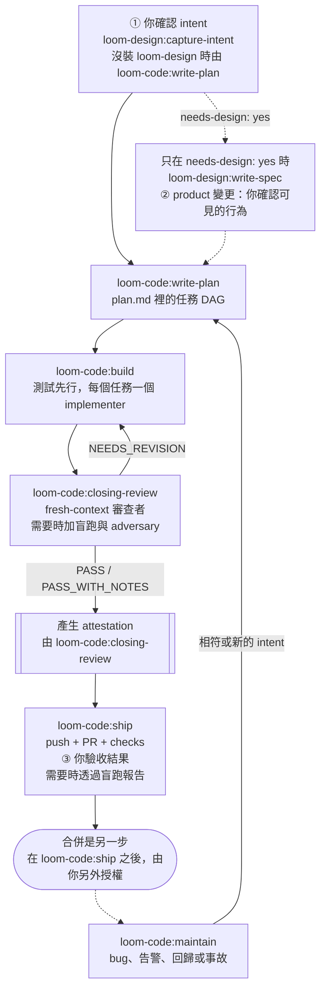

# loom-code

> **五個站把一次變更從確認過的 intent 送到已發布的 pull request；任何東西
> 離開本機之前，決定性的 checker 會重算一次證據。** loom-code 假設你具備
> 基本軟體工程知識，而不是熟悉這個 plugin：每次變更最多問你三個問題，其餘
> 自己決定並記下理由。品質的來源是機器檢查機器 —— 寫的 agent 永遠不會是
> 審的 agent。

**版本**：3.1.4 · **Skills**：5 個站 + 1 個入口路由 · [CHANGELOG.md](CHANGELOG.md)
**語言**：[English](README.md) | [日本語](README.ja.md) | [繁體中文](README.zh-TW.md)
**儲存庫**：[kouko/loom-plugins](https://github.com/kouko/loom-plugins)

---

## 一次變更怎麼走



- **Intent** —— 裝了 `loom-design` 時由 `capture-intent` 確認 intent（①）；
  沒裝時，`write-plan` 自己覆述這次變更並問 ①。
- **規格** —— 只有 product 變更會問 ②，由寫 spec 的那一方問：
  `loom-design:write-spec`，或只裝 code 時 `write-plan` 寫的最小 spec。
- **建置與審查** —— `build` 為每個任務派一個 implementer，測試先行。`closing-review`
  跑一次收尾審查；`NEEDS_REVISION` 把發現退回 `build`，通過的證據會產生為一份
  綁定受審功能內容的 attestation。
- **Ship** —— push 分支、開 PR、確認必要的 checks（③）。Ship 從不合併：合併是
  另一步，需要你另外明確授權。
- **Maintain** —— 在進行中未合併變更之外發生的 bug 回報、告警、回歸或事故，
  會掛到相符的 open intent 上，沒有就新建一份，再交給 `write-plan`。

## Skills

| Skill | 角色 |
|---|---|
| [`write-plan`](skills/write-plan/SKILL.md) | 把確認過的 intent 變成 `docs/loom/<change-id>/plan.md`：分 wave 的任務，各帶檔案、負責的 Acceptance 行、測試案例與風險。沒裝 `loom-design` 時自己跑 ①。 |
| [`build`](skills/build/SKILL.md) | 每個任務派一個 implementer，以測試先行實作 plan。 |
| [`closing-review`](skills/closing-review/SKILL.md) | 跑收尾審查——審查者，視需要加盲跑與對抗程式——並產生 `docs/loom/<change-id>/attestation.json`。 |
| [`ship`](skills/ship/SKILL.md) | 驗證 attestation、push、開 PR、確認必要的 checks（決策點 ③）。從不合併。 |
| [`maintain`](skills/maintain/SKILL.md) | 重現發生在進行中未合併變更之外的事故，掛到相符的 open intent 或新建一份，再交給 `write-plan`。 |
| [`using-loom-code`](skills/using-loom-code/SKILL.md) | 選配的入口路由，替一般 Loom 請求挑站；每個站仍可直接呼叫。 |

## Agents

各站派出下列 agent；沒有任何 agent 審自己的產出。

| Agent | 派出者 | 角色 |
|---|---|---|
| [`implementer`](agents/implementer.md) | `build` | 一個任務：先寫會失敗的測試、一個 commit、一份狀態回報 —— 不下 verdict。 |
| [`reviewer`](agents/reviewer.md) | `closing-review` | fresh-context 的 verdict（`PASS` / `PASS_WITH_NOTES` / `NEEDS_REVISION`）與帶位置的發現；從不修改受審對象。 |
| [`blind-runner`](agents/blind-runner.md) | `closing-review` | 在乾淨環境跑這次變更、逐條走過每一行 Acceptance，寫出 `docs/loom/<change-id>/blind-run-report.md`。 |
| [`adversary`](agents/adversary.md) | `closing-review` | 設法讓變更失敗 —— mutation 或 fuzz 工具，或至少三個可執行的濫用與邊界案例 —— 並把每次嘗試記成 probe。 |

審查者人數不是 agent 自己選的：`loom_checker.py reviewer-count` 依整條分支的
差異計算 —— 範圍窄且低風險的變更一位，其他情況或無法判斷時兩位。只有當某行
Acceptance 無法機械判定時才會盲跑。

## 會問你的三個問題

其餘全部代你決定，並記下理由。

1. **這是你要的嗎？** —— 在任何程式碼存在之前，用白話覆述你的意圖。
2. **你打 X，會看到 Y，對嗎？** —— 可見的行為。只有 product 變更會問，
   engineering 不問。
3. **做到了嗎？** —— 你驗收結果；需要盲跑報告時，讀的是從未碰過這次變更的
   agent 寫的那份報告。

不可逆的岔路（刪資料、公開介面、單向遷移）在 engineering 變更時併進 ①、
product 變更時併進 ②，用後果的形式問 —— 不另開停頓點。

## contract package

`contract/manifest.yaml` 宣告站、工具、action，以及每一種 artifact ——
intent、spec、plan、attestation、盲跑報告、`KICKOFF-DEFAULTS.md` —— 的
charter 與欄位，還有 standing document。空白範本在 `contract/templates/`。
只有 loom-code 寫它。`loom-design` 讀它並宣告 `requires-contract`；
`loom-workflow` 不宣告——只有它的 `decision-map` skill 在一次 delivery 前跑
`contract --require`。

## checker

`scripts/loom_checker.py` 是決定性層：每條規則都從 repo 重算，不採信宣稱，
規則清單以 `--list-rules` 為準。通過時退出碼 0，規則擋下時 1，用法或內部
錯誤時 2 —— 無法判斷的 checker 永遠不會說「沒問題」。各站在 intake、
`reviewer-count` 與 `finalize-review` 時呼叫它；`finalize-review` 只跑一次
package 測試與對抗程式，並產生綁定內容的 attestation。已安裝的 `PreToolUse`
hook 在 `git push` 與 `gh pr create` 之前再跑一次：重算內容 digest，並在不重跑
測試或 probe 的情況下驗證那份證據。

## 與 loom-design、loom-workflow 組合

三個 plugin 可獨立安裝：loom-code 不需要 `loom-design`，也不需要
`loom-workflow`；某一站走到選配的交接而該 plugin 不在時，該交接以 N/A 加理由
回報，並在自身契約允許的範圍內繼續。

- **loom-design** 在 `write-plan` 上游加上 `capture-intent` 與 `write-spec`；
  沒裝時，`write-plan` 自己確認 intent 並寫最小 spec。
- **loom-workflow** 在各站周圍加上工具，例如 `ship` 用
  `loom-workflow:git-memory` 為 PR 內文分類 memory。

相接處只有帶 plugin 名的 skill 名（例如 `loom-design:write-spec`）、contract
package，以及專案自己的 `docs/loom/` 產物 —— 不會去讀別的 plugin 的
`hooks/`、`skills/`、`scripts/`。

## 安裝

這個儲存庫是一個名為 `loom` 的 plugin marketplace。

### Claude Code

```bash
claude plugin marketplace add https://github.com/kouko/loom-plugins.git
claude plugin install loom-code@loom
```

`loom-design` 與 `loom-workflow` 安裝方式相同。

### Codex

```bash
codex plugin marketplace add https://github.com/kouko/loom-plugins.git
codex plugin add loom-code@loom
codex plugin list
```

已安裝的 `PreToolUse` hook 負責攔截發布操作；採用的 repo 不需要保存 checker
副本、複製的 contract 或 trust ledger。

若要安全更新，請依序執行：

```bash
codex plugin marketplace upgrade loom
codex plugin add loom-code@loom
codex plugin list
```

`plugin add` 會替換已安裝版本的快取，因此可能刪除執行中 task 仍持有的版本化
hook 路徑。安裝成功後，請立刻重新啟動 Codex，再執行任何其他工具或命令。不要
先移除 plugin；那只會讓同一段路徑失效期間更早開始。

### Antigravity CLI

Antigravity CLI（`agy`）從本機目錄安裝 plugin。先 clone repo，並在另外兩個
plugin 之前安裝 `loom-code`：

```bash
git clone https://github.com/kouko/loom-plugins.git
cd loom-plugins
agy plugin validate ./loom-code
agy plugin install ./loom-code
agy plugin list
```

使用時，在專案目錄啟動 `agy` 並以絕對路徑把專案加為 workspace：
`agy --add-dir "$PWD"`（互動）或 `agy --add-dir "$PWD" -p "..."`（print 模式）；
agy 1.2.2 不接受 `.` 這類相對路徑。沒有 `--add-dir` 時，print 模式（`agy -p`）
不會掛上 workspace，loom 的 kickoff defaults 不會載入，agent 也可能在專案外動作；
互動模式也請一併指定。

更新時在 clone 裡執行 `git pull`，再重跑 install（install 會取代已安裝的副本）；
移除用 `agy plugin uninstall loom-code`。hook（publication gate、session
context 與語言提醒）只在 `agy` CLI 執行，Antigravity 桌面 app 與 IDE 裡不會執行。在 `agy`
上，loom 的角色（implementer、reviewer、adversary、blind-runner）以 agy 的
`self` subagent 執行，遵循 loom 的 agent 契約，使用 Gemini 模型。審查站在所有
host 上都叫 `closing-review`，舊名 `review` 已移除，沒有別名。

## 授權

MIT。loom-code 原本在 `monkey-skills` 開發，現在位於
[kouko/loom-plugins](https://github.com/kouko/loom-plugins)。
