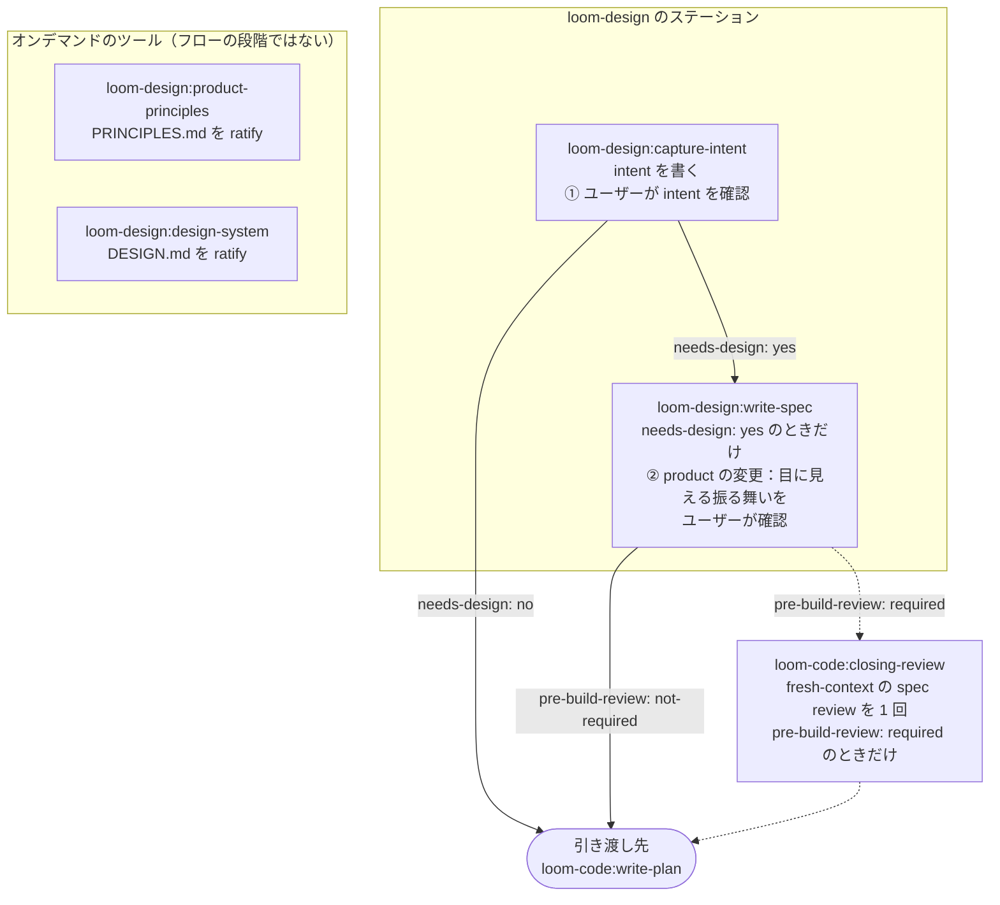

# loom-design

> **Loom フローの入口：2 つのステーションが漠然としたアイデアを確認済みの
> intent に変え、設計が要る変更ならさらに spec に変える。2 つのツールが
> プロダクトの原則とビジュアルシステムを決める。** loom-design は下書きを
> 書くだけで、採点はしない。ここで作ったものへの verdict はすべて
> `loom-code:closing-review` が、下書きを書いていない agent の手で下す。

**Version**: 2.2.0 — 4 skills + 任意のルーター 1 個。リリースは
[CHANGELOG.md](CHANGELOG.md) を参照。
**Languages**: [English](README.md) | [日本語](README.ja.md) | [繁體中文](README.zh-TW.md)
**Repository**: [kouko/loom-plugins](https://github.com/kouko/loom-plugins)

---

## フロー



- **① Intent** — `capture-intent` は求める結果がはっきりするまでだけ
  ヒアリングし、`docs/loom/intent/<change-id>.md` を書き、ユーザーの言葉で
  言い直して yes を待つ。引き渡し先は intent の `needs-design:` 行で決まる：
  `yes` なら `write-spec` へ、`no` なら `loom-code:write-plan` へ直接。
- **② Specification** — `write-spec` は確認済みの intent を
  `docs/loom/<change-id>/spec.md` にする。`kind: product` の変更では目に
  見える振る舞いを平易な言葉で読み返し、yes を記録する。engineering の
  変更はここで止まらない。spec が `pre-build-review: required` を宣言した
  ときは、計画の前に `loom-code:closing-review` で fresh-context の
  `spec+adversarial` reviewer 1 人の review を受ける。そうでなければ
  `loom-code:write-plan` へ直接進む。
- **ツール** — `product-principles` と `design-system` は頼まれたときに
  動き、それぞれプロジェクトのルートにファイルを 1 つ書く。フローの段階
  ではない。

## Skills

| Skill | 種類 | 生成物 | 役割 |
|---|---|---|---|
| [`capture-intent`](skills/capture-intent/SKILL.md) | ステーション | `docs/loom/intent/<change-id>.md` | 変更の intent をヒアリングし、書き、確認する（決定ポイント ①）。 |
| [`write-spec`](skills/write-spec/SKILL.md) | ステーション | `docs/loom/<change-id>/spec.md` | 確認済みの intent から要件、設計上の決定、現状の証拠、UI flows を書く（決定ポイント ②、product のみ）。 |
| [`product-principles`](skills/product-principles/SKILL.md) | ツール | `PRINCIPLES.md` | プロダクトの常設の原則を ratify する：順序付きの Non-negotiables 3 件以上と `ratified-by: <name> <date>` の行。 |
| [`design-system`](skills/design-system/SKILL.md) | ツール | `DESIGN.md` | UI を持つプロダクトのビジュアルシステムを ratify する：色・タイポグラフィ・余白・形状・コンポーネントの token。 |
| [`using-loom-design`](skills/using-loom-design/SKILL.md) | ルーター | — | 任意：プロダクト定義に関する幅広い依頼を上の 4 skills のどれかに振り分ける。前提条件ではなく、各 skill は直接呼び出せる。 |

**常設ドキュメント。** リポジトリに ratify 済みの `PRINCIPLES.md` が無い
間は、`kind: product` の変更を loom-code の checker
（`standing.product-principles-reject`）が受け付けない。そのときは
`capture-intent` が決定ポイント ① の中で同じ原則のヒアリングを行う。
`DESIGN.md` はどのステーションでも変更を止めない。`write-spec` は
`DESIGN.md` があれば UI flows の語彙として読む。どちらのツールも、
ユーザー自身の yes なしに `ratified-by:` の行を書かない。

## ユーザーに尋ねること

1 つの変更がユーザーに尋ねることは 3 つ。最初の 2 つが loom-design の担当：

1. **① これがやりたいことですか？** — `capture-intent` で。言い直した
   intent に、取り消しにくい選択をその結果の形で織り込む。
   `status: confirmed` でない intent は下流のどこも受け取らない。
2. **② X をすると Y が見える、で合っていますか？** — `write-spec` で、
   product の変更のときだけ。`confirmed-behavior:` として記録される。
3. **③ うまくいきましたか？** — フローの最後、`loom-code` で。各
   Acceptance 行をどう試したかを示すレポートを通して。

タスクの分け方、review の仕組み、検証の方法がユーザーに尋ねられることはない。

## loom-code との関係

loom-design には `loom-code` が必要：

- **loom-code の contract を読む。** loom-design は `loom-code` の
  contract package を書かない。`plugin.json` は
  `requires-contract: ">=2.1"` を宣言し、各ステーションとツールは最初に
  `python3 <loom-code>/scripts/loom_checker.py contract --require 2.1`
  を実行する。バージョンが合わなければ、理解できない contract に向けて
  下書きを書くのではなく止まる。Codex では `<loom-code>` はインストール
  済みの plugin ディレクトリ。リポジトリ内に checker のコピーを作らない。
- **verdict は loom-code が下す。** 計画前の spec review も最後の
  closing review も `loom-code:closing-review` で fresh-context の reviewer が行う。
  loom-design は checker のルール名を挙げるだけで、実行はしない。
- **loom-code に引き渡す。** loom-design を抜ける先は `loom-code:write-plan`
  で、`needs-design: no` のときは `capture-intent` から、それ以外は
  `write-spec` から入る。loom-design が入っていなければ、`write-plan` が
  決定ポイント ① を自分で行う。

plugin 同士は `loom-design:write-spec` のような plugin 名付き skill 名、
contract package、そしてプロジェクト自身の `docs/loom/` の artifact
だけで繋がる。

## インストール

このリポジトリは `loom` という名前の plugin marketplace。loom-design には
`loom-code` が必要なので、一緒にインストールする。

### Claude Code

```sh
claude plugin marketplace add https://github.com/kouko/loom-plugins.git
claude plugin install loom-code@loom
claude plugin install loom-design@loom
```

### Codex

```sh
codex plugin marketplace add https://github.com/kouko/loom-plugins.git
codex plugin add loom-code@loom
codex plugin add loom-design@loom
```

### Antigravity CLI

repo を clone し、`loom-code` を先にインストールする。

```bash
git clone https://github.com/kouko/loom-plugins.git
cd loom-plugins
agy plugin install ./loom-code
agy plugin install ./loom-design
```

使うときは、プロジェクトのディレクトリでプロジェクトを絶対パスで workspace に追加して
`agy` を起動する：`agy --add-dir "$PWD"`（対話）または
`agy --add-dir "$PWD" -p "..."`（print モード）。agy 1.2.2 は `.` のような相対パスを
受け付けない。`--add-dir` がないと print モード（`agy -p`）では agy は workspace を
持たないため、loom の kickoff defaults が読み込まれず、agent がプロジェクトの外で
作業することがある。対話モードでも指定する。

loom-design 自体は hook を持たない。loom-code の hook が走るのは `agy` CLI だけで、
Antigravity のデスクトップアプリや IDE では走らない。

## テスト

```sh
python3 -m pytest loom-design/scripts/
```

1 回の実行で `interface/`・`principles/`・`spec/` の各ディレクトリを
収集する。`scripts/pytest.ini` が `--import-mode=importlib` を設定し、
同名の test モジュールが並存できるようにしている。3 つの plugin すべての
パッケージテストは、リポジトリのルートから実行する：

```sh
uv run --isolated --with-requirements requirements-package-tests.lock python scripts/run_package_tests.py --loom-family -q
```

## 由来

loom-design は `monkey-skills` リポジトリで開発され、このリポジトリに
切り出された。`plugin.json` の `homepage` と `repository` は今もその
歴史的な出自を指している。

## ライセンス

MIT。[LICENSE](https://github.com/kouko/loom-plugins/blob/main/LICENSE) を参照。
