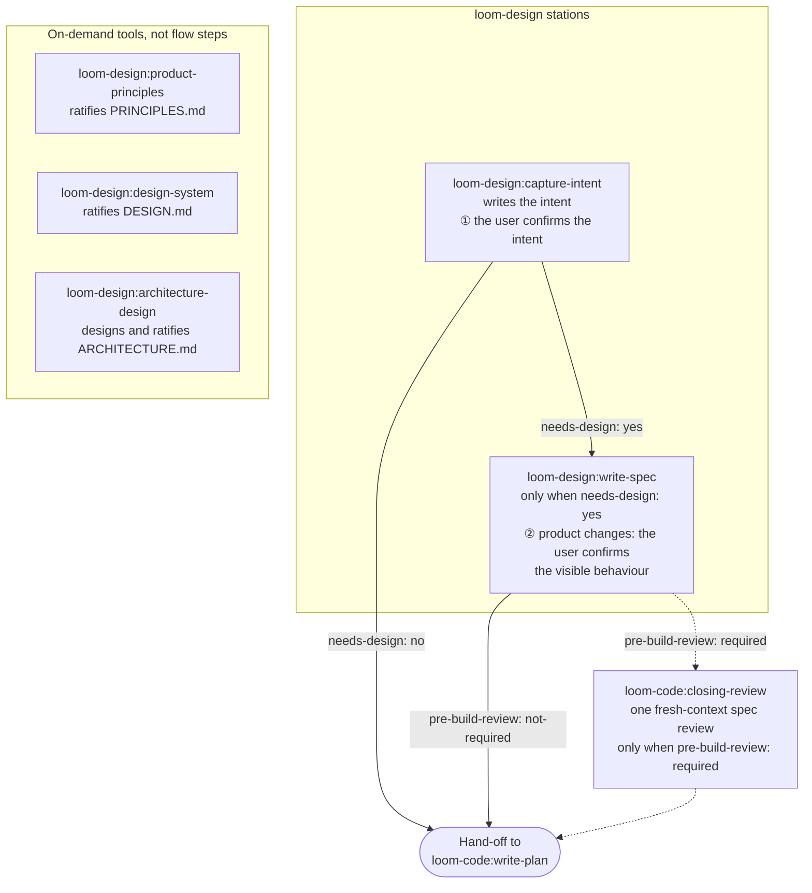

# loom-design

> **The front of the Loom flow: two stations turn a rough idea into a
> confirmed intent and, when the change needs design, a spec; three tools give
> a product its principles, its visual system and its architecture.** loom-design drafts; it
> never grades. Every verdict on what it produces is rendered by
> `loom-code:closing-review`, by an agent that did not write the draft.

**Version**: 2.4.1 — 5 skills + 1 optional router. See
[CHANGELOG.md](CHANGELOG.md) for releases.
**Languages**: [English](README.md) | [日本語](README.ja.md) | [繁體中文](README.zh-TW.md)
**Repository**: [kouko/loom-plugins](https://github.com/kouko/loom-plugins)

---

## The flow



- **① Intent** — `capture-intent` interviews only until the wanted outcome
  is clear, writes `docs/loom/intent/<change-id>.md`, restates it in the
  user's words and waits for a yes. It then hands off by the intent's
  `needs-design:` line: `yes` goes to `write-spec`, `no` goes straight to
  `loom-code:write-plan`.
- **② Specification** — `write-spec` turns a confirmed intent into
  `docs/loom/<change-id>/spec.md`. For a `kind: product` change it reads the
  visible behaviour back in plain words and records the yes; an engineering
  change is not stopped here. When the spec declares
  `pre-build-review: required`, it goes to `loom-code:closing-review` for one
  fresh-context `spec+adversarial` reviewer before planning; otherwise it
  goes straight to `loom-code:write-plan`.
- **Tools** — `product-principles`, `design-system` and `architecture` run when asked, each
  writing one standing document at the project root. They are not steps in the flow.

## Skills

| Skill | Kind | Produces | Role |
|---|---|---|---|
| [`capture-intent`](skills/capture-intent/SKILL.md) | station | `docs/loom/intent/<change-id>.md` | Interview, write and confirm a change intent (decision point ①). |
| [`write-spec`](skills/write-spec/SKILL.md) | station | `docs/loom/<change-id>/spec.md` | Write requirements, design decisions, current-state evidence and UI flows from a confirmed intent (decision point ②, product only). |
| [`product-principles`](skills/product-principles/SKILL.md) | tool | `PRINCIPLES.md` | Ratify the product's standing principles: at least three ordered Non-negotiables and a `ratified-by: <name> <date>` line. |
| [`design-system`](skills/design-system/SKILL.md) | tool | `DESIGN.md` | Ratify the visual system for a product with a UI: colour, type, spacing, shape and component tokens. |
| [`architecture`](skills/architecture/SKILL.md) | tool | `ARCHITECTURE.md` | Design the project's architecture with the user — module boundaries, tech choices, folder layout, CI stages — then back each rule with a guard test. |
| [`using-loom-design`](skills/using-loom-design/SKILL.md) | router | — | Optional: route a broad product-definition request to one of the five skills above. It is not a prerequisite; each skill can be called directly. |

**Standing documents.** A `kind: product` change is refused by loom-code's
checker (`standing.product-principles-reject`) while the repository has no
ratified `PRINCIPLES.md`; `capture-intent` runs the same principles interview
inside decision point ① when that happens. `DESIGN.md` never blocks a change
at any station; `write-spec` reads it, when present, for its UI-flow
vocabulary. Neither tool writes its `ratified-by:` line without the user's
own yes.

## What the user is asked

A change asks its user three things. loom-design owns the first two:

1. **① Is this what you want?** — at `capture-intent`: the restated intent,
   with any choice that is expensive to undo phrased as its consequence.
   Nothing downstream accepts an intent that is not `status: confirmed`.
2. **② You do X and you see Y — right?** — at `write-spec`, for product
   changes only; recorded as `confirmed-behavior:`.
3. **③ Did it work?** — at the end of the flow in `loom-code`, through the
   report showing how each Acceptance line was tried.

Nothing about task splitting, review mechanics or verification is put to
the user.

## Relationship to loom-code

loom-design requires `loom-code`:

- **It reads loom-code's contract.** loom-design never writes
  `loom-code`'s contract package. `plugin.json` declares
  `requires-contract: ">=2.1"`, and each station and tool first runs
  `python3 <loom-code>/scripts/loom_checker.py contract --require 2.1`,
  stopping on a mismatch instead of drafting against a contract it does not
  understand. On Codex, `<loom-code>` is the installed plugin directory;
  never create a repository-local checker copy.
- **Its verdicts are rendered by loom-code.** The pre-build spec review and
  the closing review both run in `loom-code:closing-review`, with fresh-context
  reviewers; loom-design only names the checker rules, it never runs them.
- **It hands off to loom-code.** The flow leaves loom-design at
  `loom-code:write-plan`: from `capture-intent` when `needs-design: no`,
  otherwise from `write-spec`. Without loom-design installed, `write-plan`
  runs decision point ① itself.

The plugins compose only through plugin-qualified skill names such as
`loom-design:write-spec`, the contract package and the project's own
`docs/loom/` artifacts.

## Install

This repository is a plugin marketplace named `loom`. Install `loom-code`
as well; loom-design requires it.

### Claude Code

```sh
claude plugin marketplace add https://github.com/kouko/loom-plugins.git
claude plugin install loom-code@loom
claude plugin install loom-design@loom
```

### Codex

```sh
codex plugin marketplace add https://github.com/kouko/loom-plugins.git
codex plugin add loom-code@loom
codex plugin add loom-design@loom
```

### Antigravity CLI

Install from a clone of the repository, `loom-code` first:

```bash
git clone https://github.com/kouko/loom-plugins.git
cd loom-plugins
agy plugin install ./loom-code
agy plugin install ./loom-design
```

To use loom, start `agy` from your project with the project added as a
workspace by absolute path: `agy --add-dir "$PWD"` (interactive) or
`agy --add-dir "$PWD" -p "..."` (print mode); agy 1.2.2 does not honour a
relative path such as `.`. Without `--add-dir`, print mode (`agy -p`)
attaches no workspace, so loom's kickoff defaults are not loaded and the
agent may act outside the project; pass it in interactive mode too.

loom-design ships no hooks; loom-code's hooks run only in the `agy` CLI, not
in the Antigravity desktop app or IDE.

## Tests

```sh
python3 -m pytest loom-design/tests/
```

One invocation collects the `interface/`, `principles/` and `spec/`
directories; `tests/pytest.ini` sets `--import-mode=importlib` so
same-named test modules can sit side by side. The complete package suite
for all three plugins runs from the repository root:

```sh
uv run --isolated --with-requirements requirements-package-tests.lock python scripts/run_package_tests.py --loom-family -q
```

## Provenance

loom-design was developed in the `monkey-skills` repository and extracted
into this one; the `homepage` and `repository` fields in `plugin.json` still
name that historical origin.

## License

MIT. See [LICENSE](https://github.com/kouko/loom-plugins/blob/main/LICENSE).
