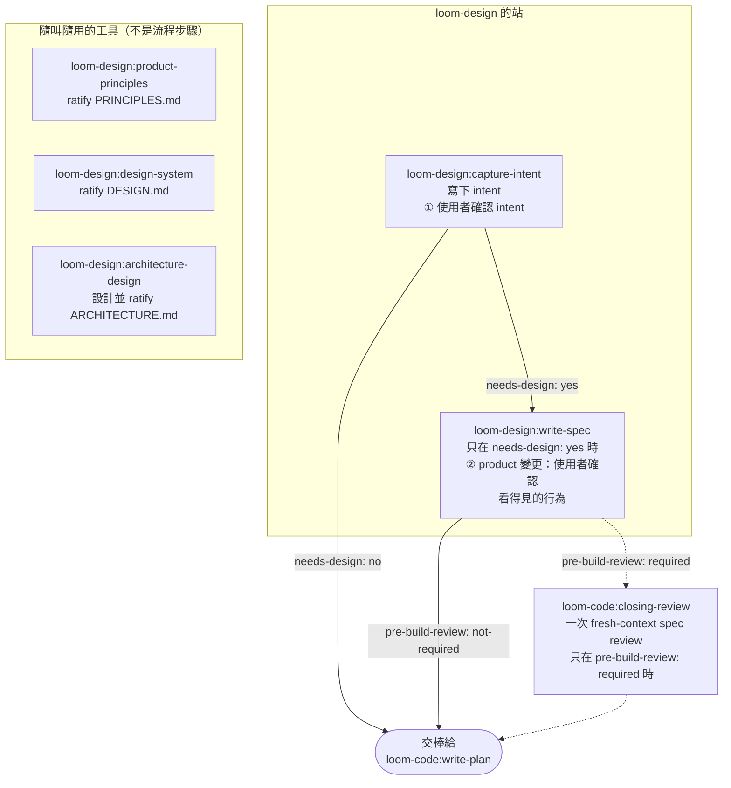

# loom-design

> **Loom 流程的入口：兩個站把粗略的想法變成確認過的 intent，變更需要設計時
> 再變成一份 spec；三個工具決定產品的原則、視覺系統與架構。** loom-design 只寫
> 草稿，不打分數。這裡產出的東西一律由 `loom-code:closing-review` 下 verdict，而且
> 下判斷的 agent 不是寫草稿的那一個。

**Version**: 2.4.2 — 5 個 skill + 1 個可選入口路由。版本資訊見
[CHANGELOG.md](CHANGELOG.md)。
**Languages**: [English](README.md) | [日本語](README.ja.md) | [繁體中文](README.zh-TW.md)
**Repository**: [kouko/loom-plugins](https://github.com/kouko/loom-plugins)

---

## 流程



- **① Intent** — `capture-intent` 只訪談到想要的結果清楚為止，寫下
  `docs/loom/intent/<change-id>.md`，用使用者的話覆述一次，然後等一個 yes。
  接著依 intent 的 `needs-design:` 行交棒：`yes` 交給 `write-spec`，`no`
  直接交給 `loom-code:write-plan`。
- **② Specification** — `write-spec` 把確認過的 intent 寫成
  `docs/loom/<change-id>/spec.md`。`kind: product` 的變更會用白話把看得見的
  行為讀回去並記下 yes；engineering 變更不在這裡停。spec 宣告
  `pre-build-review: required` 時，規劃前先交給 `loom-code:closing-review`，由一位
  fresh-context 的 `spec+adversarial` reviewer 審一次；否則直接交給
  `loom-code:write-plan`。
- **工具** — `product-principles`、`design-system` 與 `architecture` 是你叫它才跑，各自在
  專案根目錄寫一份常設文件。它們不是流程裡的步驟。

## Skills

| Skill | 類型 | 產物 | 角色 |
|---|---|---|---|
| [`capture-intent`](skills/capture-intent/SKILL.md) | 站 | `docs/loom/intent/<change-id>.md` | 訪談、寫下並確認一個變更的 intent（決策點 ①）。 |
| [`write-spec`](skills/write-spec/SKILL.md) | 站 | `docs/loom/<change-id>/spec.md` | 從確認過的 intent 寫出需求、設計決策、現狀證據與 UI flows（決策點 ②，僅 product）。 |
| [`product-principles`](skills/product-principles/SKILL.md) | 工具 | `PRINCIPLES.md` | Ratify 產品的常設原則：至少三條有順序的 Non-negotiables，以及一行 `ratified-by: <name> <date>`。 |
| [`design-system`](skills/design-system/SKILL.md) | 工具 | `DESIGN.md` | Ratify 有 UI 的產品的視覺系統：顏色、字級、間距、形狀與元件 token。 |
| [`architecture`](skills/architecture/SKILL.md) | 工具 | `ARCHITECTURE.md` | 和使用者一起設計專案架構：模組邊界、技術選型、資料夾結構、CI 階段，再用守護測試撐住每條規則。 |
| [`using-loom-design`](skills/using-loom-design/SKILL.md) | 入口路由 | — | 可選：把較廣泛的產品定義請求分派給上面五個 skill 之一。不是前置條件；每個 skill 都能直接呼叫。 |

**常設文件。** 只要 repo 裡沒有 ratify 過的 `PRINCIPLES.md`，`kind: product`
的變更就會被 loom-code 的 checker（`standing.product-principles-reject`）
拒收；這時 `capture-intent` 會在決策點 ① 裡跑同一套原則訪談。`DESIGN.md`
在任何一站都不擋變更；`write-spec` 在它存在時讀它，當作 UI flows 的用語。
兩個工具都不會在使用者親口說 yes 之前寫上 `ratified-by:` 行。

## 會問使用者什麼

一次變更總共問使用者三件事，前兩件歸 loom-design：

1. **① 這是你要的嗎？** — 在 `capture-intent`：覆述後的 intent，任何難以
   反悔的選擇都用「之後就會怎樣」的後果形式併進來。下游沒有任何一站會收
   非 `status: confirmed` 的 intent。
2. **② 你做 X 就會看到 Y，對嗎？** — 在 `write-spec`，只在 product 變更問；
   答案記成 `confirmed-behavior:`。
3. **③ 做到了嗎？** — 在流程最後的 `loom-code`，透過一份說明每條
   Acceptance 怎麼試過的報告。

任務怎麼切、review 怎麼跑、怎麼驗證，都不會拿去問使用者。

## 與 loom-code 的關係

loom-design 需要 `loom-code`：

- **它讀 loom-code 的 contract。** loom-design 絕不寫 `loom-code` 的
  contract package。`plugin.json` 宣告 `requires-contract: ">=2.1"`，每個站
  與工具的第一步都是
  `python3 <loom-code>/scripts/loom_checker.py contract --require 2.1`，
  版本對不上就停下，而不是對著看不懂的 contract 硬寫。在 Codex 上
  `<loom-code>` 是已安裝的 plugin 目錄；絕不在 repo 裡建 checker 副本。
- **它的 verdict 由 loom-code 下。** 規劃前的 spec review 與最後的 closing
  review 都在 `loom-code:closing-review` 由 fresh-context reviewer 進行；
  loom-design 只點名 checker 規則，從不執行它們。
- **它交棒給 loom-code。** 流程離開 loom-design 都在 `loom-code:write-plan`：
  `needs-design: no` 時從 `capture-intent` 離開，否則從 `write-spec` 離開。
  沒裝 loom-design 時，`write-plan` 會自己跑決策點 ①。

plugin 之間只透過帶 plugin 名的 skill 名稱（例如 `loom-design:write-spec`）、
contract package，以及專案自己的 `docs/loom/` 產物相接。

## 安裝

這個 repo 是一個名為 `loom` 的 plugin marketplace。loom-design 需要
`loom-code`，請一起安裝。

### Claude Code

```sh
claude plugin marketplace add https://github.com/kouko/loom-plugins.git
claude plugin install loom-code@loom
claude plugin install loom-design@loom
```

### Codex

```sh
codex plugin marketplace add https://github.com/kouko/loom-plugins.git
codex plugin add loom-code@loom
codex plugin add loom-design@loom
```

### Antigravity CLI

從 repo 的 clone 安裝，先裝 `loom-code`：

```bash
git clone https://github.com/kouko/loom-plugins.git
cd loom-plugins
agy plugin install ./loom-code
agy plugin install ./loom-design
```

使用時，在專案目錄啟動 `agy` 並以絕對路徑把專案加為 workspace：
`agy --add-dir "$PWD"`（互動）或 `agy --add-dir "$PWD" -p "..."`（print 模式）；
agy 1.2.2 不接受 `.` 這類相對路徑。沒有 `--add-dir` 時，print 模式（`agy -p`）
不會掛上 workspace，loom 的 kickoff defaults 不會載入，agent 也可能在專案外動作；
互動模式也請一併指定。

loom-design 本身沒有 hook；loom-code 的 hook 只在 `agy` CLI 執行，Antigravity
桌面 app 與 IDE 裡不會執行。

## 跑測試

```sh
python3 -m pytest loom-design/tests/
```

一次呼叫就收齊 `interface/`、`principles/`、`spec/` 三個目錄；
`tests/pytest.ini` 設 `--import-mode=importlib`，讓同名的 test 模組能並存。
三個 plugin 的完整套件測試從 repo 根目錄執行：

```sh
uv run --isolated --with-requirements requirements-package-tests.lock python scripts/run_package_tests.py --loom-family -q
```

## 來源

loom-design 原本在 `monkey-skills` repo 開發，之後抽出到這個 repo；
`plugin.json` 的 `homepage` 與 `repository` 欄位仍指向那個歷史出處。

## 授權

MIT。見 [LICENSE](https://github.com/kouko/loom-plugins/blob/main/LICENSE)。
