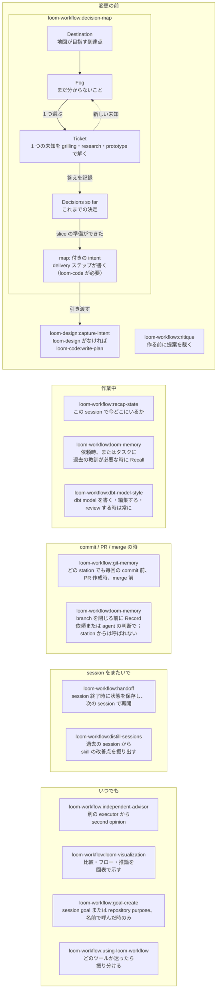

# loom-workflow

Read this in: [English](README.md) | **日本語** | [繁體中文](README.zh-TW.md)

> Claude Code と Codex 向けの、Loom の station を取り巻く workflow ツール群：永続的な Outcome Map、git memory、repository memory、critique、recap、handoff、session distill、chat の図表と推論ページ、second opinion。

**Version**：5.3.2 ・ **Repository**：[kouko/loom-plugins](https://github.com/kouko/loom-plugins) ・ **License**：MIT

## 概要

Loom は 1 つの変更を station に沿って運びます：`loom-design` が intent と spec
をまとめ、`loom-code` が plan・build・review・ship を行います。`loom-workflow`
はその station の周りで使うツールを収めています。ツール自体は station
ではありません。それぞれ決まったタイミングで使うか、必要な時に呼び出すもので、
どのツールも名前で直接呼び出せます。

どのツールも `loom-workflow` 単体のインストールで動きます。唯一の例外は
`decision-map` の delivery ステップで、`loom-code` の contract template から
intent を書くため `loom-code` が必要です。地図の作成と ticket の推進には不要です。

## 収録基準（Admission rule）

skill がここに属するのは、station をまたいで作業を調整するか、session
をまたいで状態を運ぶ場合です。複数の plugin から使われているだけでは条件を満たしません。
`decision-map` がこのルールの最初の実例です。このルールは新規の収録のみを
gate し、plugin にすでにある utility skill はそのまま残ります。

## どのタイミングでどのツールを使うか

これは 1 本の順序付きフローではありません。ツールは使うタイミングごとにまとめてあり、
矢印は `decision-map` 自身のループと、station への引き渡しだけです。



- **変更の前** — `decision-map` は、全体の道筋を最初に列挙できない作業のためのものです。
  Outcome Map は `docs/loom/maps/<map-id>/` にあり、session をまたいで残ります。
  slice の準備ができると、delivery ステップが `map:` 付きの intent を書き、
  `loom-design:capture-intent`（`loom-design` がなければ `loom-code:write-plan`）
  に引き渡します。以後の変更はその station が受け持ちます。`critique`
  は何かを作る前に提案を裁きます。
- **作業中** — `recap-state` は現在の会話の中で状況を捉え直させます。`loom-memory`
  は依頼された時、またはタスクに必要な時に過去の教訓を Recall します。
  `dbt-model-style` は dbt model を書く・編集する・review する時に常に適用します。
- **commit / PR / merge の時** — `git-memory` はどの station でも毎回の commit
  前、PR 作成時、そして `ship` の後に行う PR の merge 前に動きます。`loom-memory`
  は branch を閉じる前に、依頼または agent の判断で永続的な教訓を Record します。
  station からは呼ばれません。
- **session をまたいで** — `handoff` は session の終わりに状態を保存し、次の
  session で再開します。`distill-sessions` は過去の session から skill の改善提案を掘り出します。
- **いつでも** — `independent-advisor` は別の executor に second opinion を求め、
  `loom-visualization` は比較・フロー・推論を table や図で示し、推論ページも作ります。`goal-create` は名前で呼んだ時だけ動き、
  `using-loom-workflow` は適切なツールが分からない依頼を振り分けます。

## Skills

12 skills：11 個のツールと任意のルーター 1 個。

| Skill | 役割 |
|---|---|
| [`using-loom-workflow`](skills/using-loom-workflow/) | 任意のルーター：広い・曖昧な依頼に合うツールを選び、その手順を読み込む。各ツールは引き続き直接呼び出せる。 |
| [`decision-map`](skills/decision-map/) | `docs/loom/maps/<map-id>/` にある永続的な Outcome Map を作成・推進する：Destination、fog、種類付きの ticket、Decisions-so-far ログ。delivery ステップは intent を書く。 |
| [`critique`](skills/critique/) | 作る前に提案を裁く：`mode: proposal` は list や plan を KEEP / DEFER / DROP に振り分け、`mode: complexity` は 1 つの具体的変更を deletion-first で量る。 |
| [`recap-state`](skills/recap-state/) | 作業が今どこにあるかを session 内で recap し、確認のために一度止まる。組み込みの `/recap`（away-summary）とは別物。 |
| [`loom-memory`](skills/loom-memory/) | commit された memory store 内の、リポジトリの永続的な教訓を参照・記録・照合・廃止する。 |
| [`dbt-model-style`](skills/dbt-model-style/) | dbt model を書く・編集する・review する時に、dbt + Redshift の style と structure（CTE の役割、zero-logic な final CTE、命名、comment）を適用する。計算ロジックは対象外。 |
| [`git-memory`](skills/git-memory/) | 毎回の `git commit`・`gh pr create`・`gh pr merge` の前に Decision・Learning・Gotcha の memory を分類する。過去の Git 上の決定の理由も呼び出せる。 |
| [`handoff`](skills/handoff/) | session 状態を `.claude/handoffs/` の HANDOFF ファイルに保存し、あるいは新しい session でそこから再開する。 |
| [`distill-sessions`](skills/distill-sessions/) | 過去の Claude Code と Codex の session（利用可能なら `/insights` facets も）を掘り、skill ごとに順位付けした friction とレビュー可能な SKILL.md 提案を出す。 |
| [`independent-advisor`](skills/independent-advisor/) | plan や決定について、別の executor——別の model tier、より高い effort、あるいは別ベンダー——から second opinion を取る。費用の発生やマシン外への送信には承認が必要。 |
| [`loom-visualization`](skills/loom-visualization/) | 比較・フロー・判断・状態遷移・推論の連鎖を、coding harness の chat で読み手の client に実際に表示される table・ASCII 図・Mermaid block として示す。推論ページ mode では、すでにある推論を自己完結型ページに描き出す。plain-language reference に書き方ガイド、選択肢の判断ルール、8 つの会話場面の表、表のルールがあり、ソフトウェア・デザイン・ビジネスの 3 つの表集もある。Obsidian ノートには使わない。 |
| [`goal-create`](skills/goal-create/) | 名前で呼んだ時のみ動く。SESSION は 4 項目の goal condition を起草し、ホストに受理された場合に有効化し、それ以外は正直な復旧操作を示す。ARC は repository の purpose（`Why` / `Done when`）を起草する。 |

Loom の契約で数えるツールはこのうち 8 個です。`goal-create` と `dbt-model-style`
は Loom フローの外にある standalone skill で、`loom-memory` とルーターは契約の対象外です。

## Repository 構成

```
loom-workflow/
├── .claude-plugin/
│   └── plugin.json
├── .codex-plugin/
│   └── plugin.json
├── docs/                  ガバナンス、監査、テレメトリ、設計メモ
├── hooks/
│   ├── hooks.json         UserPromptSubmit のカードと Write/Edit 後の skill フォルダ構成チェック
│   └── visualization-card loom-visualization の UserPromptSubmit visualization card
├── scripts/               plugin レベルのテストと構成チェック
├── skills/
│   ├── critique/
│   ├── dbt-model-style/
│   ├── decision-map/
│   ├── distill-sessions/
│   ├── git-memory/
│   ├── goal-create/
│   ├── handoff/
│   ├── independent-advisor/
│   ├── loom-memory/
│   ├── loom-visualization/
│   ├── recap-state/
│   └── using-loom-workflow/
├── tests/                 git-memory・loom-memory・loom-visualization のテスト
├── CHANGELOG.md
├── README.md
├── README.ja.md           (このファイル)
└── README.zh-TW.md
```

## インストール

このリポジトリは `loom` という名前の plugin marketplace です。`loom-workflow`
は単体でインストールできます。`decision-map` の delivery ステップを使う場合のみ
`loom-code` を追加してください。

### Claude Code

```sh
claude plugin marketplace add https://github.com/kouko/loom-plugins.git
claude plugin install loom-workflow@loom
```

### Codex

```sh
codex plugin marketplace add https://github.com/kouko/loom-plugins.git
codex plugin add loom-workflow@loom
```

Codex では loom-visualization の visualization card を plugin の UserPromptSubmit hook で、メッセージを送るたびに届ける。Codex がこの hook を走らせるのは、plugin の hook を確認して信頼した後だけ。以前のバージョンで信頼済みでも、hook のイベントが変わったため、もう一度確認して信頼する。

### Antigravity CLI

repo を clone し、`loom-code` を先にインストールする。`critique`・`decision-map`・
`distill-sessions` が loom-code を参照する。インストール前に `agy plugin list` で
Claude Code から取り込まれた同名の plugin がないか確認する。install はその取り込み済みの
コピーを置き換え、後の `agy plugin uninstall` はそれを削除する。

```bash
git clone https://github.com/kouko/loom-plugins.git
cd loom-plugins
agy plugin install ./loom-code
agy plugin install ./loom-workflow
```

使うときは、プロジェクトのディレクトリでプロジェクトを絶対パスで workspace に追加して
`agy` を起動する：`agy --add-dir "$PWD"`（対話）または
`agy --add-dir "$PWD" -p "..."`（print モード）。agy 1.2.2 は `.` のような相対パスを
受け付けない。`--add-dir` がないと print モード（`agy -p`）では agy は workspace を
持たないため、loom の kickoff defaults が読み込まれず、agent がプロジェクトの外で
作業することがある。対話モードでも指定する。

hook が走るのは `agy` CLI だけで、Antigravity のデスクトップアプリや IDE では走らない。
agy では loom-visualization の visualization card を plugin rule として届けるため、常に有効になる。

### 毎ターンのリマインダーが届かない環境

Claude Code と Codex では、`loom-workflow` が loom-visualization の visualization card
（ユーザーの言語で返答、結論を先に、平易な言葉、比喩を使わない文字どおりの表現、表や図）を
UserPromptSubmit hook で、メッセージを送るたびに agent に届ける。1 ターンあたり最大 181 語
（英語）増える。次の環境には届かない：

- Codex の IDE 拡張と Codex アプリ
- Antigravity のデスクトップアプリや IDE（plugin の hook と rule は `agy` CLI でしか動かない）
- `loom-workflow` なしで `loom-code` だけをインストールした場合：カードは `loom-workflow` にしか入っていない

## 使い方

`loom-workflow` は slash command を同梱していません。自然言語で依頼するか、skill
を名前で指定してください。`goal-create` は名前で呼んだ時だけ動きます。例：

```
「この 12 項目の plan を critique して」       → critique（proposal）
「そもそも作るべきか」/「作り込みすぎ？」       → critique（complexity）
「これから commit する」                       → git-memory
「デシジョンマップを開く」/「開地圖」           → decision-map
「wrap up」/「save state」                     → handoff
「今どこだっけ」/「振り返り」                   → recap-state
「second opinion」/「別のモデルに聞いて」       → independent-advisor
```

## 開発

リポジトリのルートで、パッケージのテストスイート全体を分離環境で実行します：

```sh
uv run --isolated --with-requirements requirements-package-tests.lock python scripts/run_package_tests.py --loom-family -q
```

## 由来

- `loom-workflow` は `monkey-skills` で開発され、このリポジトリに切り出されました。
  manifest 内の homepage と repository の URL は、今もその出自を指しています。
  `dev-workflow` を hard-cut rename で置き換えたため、custom reference は
  `loom-workflow:<skill>` を使います。
- `loom-memory` は、独立 plugin の廃止に伴いこの plugin に加わりました。
- `skill-creator-advance`・`skill-refactor`・`skill-tuning`・`skill-judge` は
  `skill-dev-toolkit` へ移転しました。元の設計理由は
  [`docs/skill-evolution-architecture.md`](docs/skill-evolution-architecture.md) にアーカイブされています。

## License

MIT。[LICENSE](https://github.com/kouko/loom-plugins/blob/main/LICENSE) 参照。`critique` の `mode: complexity` は joshuadavidthomas の
MIT-licensed な
[`reducing-entropy`](https://github.com/joshuadavidthomas/agent-skills/tree/main/skills/reducing-entropy)
に由来し、その `LICENSE` と `NOTICE` ファイルが copyright chain を保持しています。
