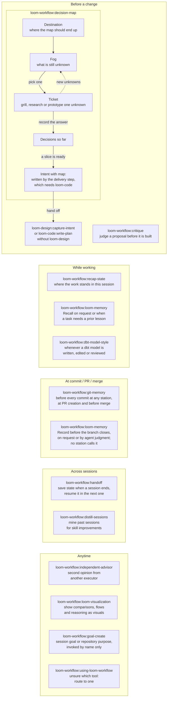

# loom-workflow

Read this in: **English** | [日本語](README.ja.md) | [繁體中文](README.zh-TW.md)

> Workflow tools around the Loom stations for Claude Code and Codex: persistent Outcome Maps, git memory, repository memory, critique, recap, handoff, session distill, chat visualizations and reasoning pages, and second opinions.

**Version**: 5.3.1 · **Repository**: [kouko/loom-plugins](https://github.com/kouko/loom-plugins) · **License**: MIT

## What it is

Loom carries one change through its stations: `loom-design` captures the
intent and spec, and `loom-code` plans, builds, reviews and ships it.
`loom-workflow` holds the tools around those stations. They are not stations
themselves: each one attaches at a specific moment or runs on demand, and every
tool can be invoked directly by name.

Every tool works with `loom-workflow` installed alone. The one exception is
`decision-map`'s delivery step, which writes an intent from `loom-code`'s
contract template and so needs `loom-code`; charting a map and working its
tickets do not.

## Admission rule

A skill belongs here when it coordinates work across stations or carries state
across sessions, not merely because several plugins use it. `decision-map` is
the rule's first instance. The rule gates new admissions only; the utility
skills already in the plugin stay.

## When you reach for which tool

This is not one sequential flow. The tools are grouped by the moment you reach
for them; the only arrows are `decision-map`'s own loop and its hand-off into
the stations.



- **Before a change** — `decision-map` is for work whose whole route cannot be
  listed up front. The Outcome Map lives at `docs/loom/maps/<map-id>/` and
  persists across sessions. When a slice is ready, its delivery step writes an
  intent carrying `map:` and hands it to `loom-design:capture-intent`, or to
  `loom-code:write-plan` without `loom-design`; that station owns the change
  from then on. `critique` judges a proposal before anything is built.
- **While working** — `recap-state` re-orients you inside the current
  conversation. `loom-memory` recalls a prior lesson when asked or when the
  task needs one. `dbt-model-style` applies whenever a dbt model is written,
  edited or reviewed.
- **At commit / PR / merge** — `git-memory` runs before every commit at any
  station, when the PR is created, and before the PR is merged, which happens
  after `ship`. `loom-memory` records a durable lesson before the branch
  closes, on request or by agent judgment; no station calls it.
- **Across sessions** — `handoff` saves state at the end of a session and
  resumes it in the next. `distill-sessions` mines past sessions for skill
  improvement proposals.
- **Anytime** — `independent-advisor` asks a different executor for a second
  opinion, `loom-visualization` shows comparisons, flows and reasoning as tables or diagrams (or a reasoning page),
  `goal-create` runs only when invoked by name, and `using-loom-workflow`
  routes a request when the right tool is unclear.

## Skills

Twelve skills: eleven tools and one optional router.

| Skill | Role |
|---|---|
| [`using-loom-workflow`](skills/using-loom-workflow/) | Optional router: picks the matching tool for a broad or unclear request and loads its instructions. Every tool stays directly invocable. |
| [`decision-map`](skills/decision-map/) | Chart or advance a persistent Outcome Map at `docs/loom/maps/<map-id>/`: a Destination, fog, typed tickets and a Decisions-so-far log; its delivery step writes an intent. |
| [`critique`](skills/critique/) | Judge a proposal before it is built: `mode: proposal` sorts a list or plan into KEEP / DEFER / DROP; `mode: complexity` weighs one specific change deletion-first. |
| [`recap-state`](skills/recap-state/) | In-session recap of where the work stands, then a pause for confirmation. Not the built-in `/recap` away-summary. |
| [`loom-memory`](skills/loom-memory/) | Recall, record, reconcile or retire durable repository lessons in the committed memory store. |
| [`dbt-model-style`](skills/dbt-model-style/) | Apply dbt + Redshift model style and structure (CTE roles, a zero-logic final CTE, naming, comments) when writing, editing or reviewing a model; calculation logic is out of scope. |
| [`git-memory`](skills/git-memory/) | Classify Decision, Learning and Gotcha memory before every `git commit`, `gh pr create` and `gh pr merge`; recall why a past Git decision was made. |
| [`handoff`](skills/handoff/) | Save session state to a HANDOFF file under `.claude/handoffs/`, or resume from one in a new session. |
| [`distill-sessions`](skills/distill-sessions/) | Mine past Claude Code and Codex sessions, with `/insights` facets when available, for friction ranked by skill and reviewable SKILL.md proposals. |
| [`independent-advisor`](skills/independent-advisor/) | Get a second opinion on a plan or decision from a different executor: another model tier, higher effort or another vendor. Spending money or sending material off the machine needs approval. |
| [`loom-visualization`](skills/loom-visualization/) | Show comparisons, flows, decisions, states, or reasoning chains in coding-harness chat as a table, ASCII diagram, or Mermaid block that actually displays in the reader's client; a reasoning page mode renders documented reasoning as a standalone page. Its plain-language reference holds a writing guide, a decision-option rule, eight conversation-situation tables and table rules; three table collections cover software, design and business. Not for Obsidian notes. |
| [`goal-create`](skills/goal-create/) | Invoked by name only. SESSION drafts a four-field goal condition and activates it when accepted by the host, with an honest recovery action otherwise; ARC drafts the repository purpose (`Why` / `Done when`). |

Loom's contract counts eight of these tools. `goal-create` and
`dbt-model-style` are standalone skills outside the Loom flow, and
`loom-memory` and the router stay outside the contract.

## Repository structure

```
loom-workflow/
├── .claude-plugin/
│   └── plugin.json
├── .codex-plugin/
│   └── plugin.json
├── docs/                  governance, audit, telemetry and design notes
├── hooks/
│   ├── hooks.json         UserPromptSubmit card and skill folder structure check after Write/Edit
│   └── visualization-card UserPromptSubmit visualization card for loom-visualization
├── scripts/               plugin-level tests and the structure check
├── skills/
│   ├── critique/
│   ├── dbt-model-style/
│   ├── decision-map/
│   ├── distill-sessions/
│   ├── git-memory/
│   ├── goal-create/
│   ├── handoff/
│   ├── independent-advisor/
│   ├── loom-memory/
│   ├── loom-visualization/
│   ├── recap-state/
│   └── using-loom-workflow/
├── tests/                 git-memory, loom-memory and loom-visualization tests
├── CHANGELOG.md
├── README.md              (this file)
├── README.ja.md
└── README.zh-TW.md
```

## Install

This repository is a plugin marketplace named `loom`. `loom-workflow` installs
on its own; add `loom-code` only if you use `decision-map`'s delivery step.

### Claude Code

```sh
claude plugin marketplace add https://github.com/kouko/loom-plugins.git
claude plugin install loom-workflow@loom
```

### Codex

```sh
codex plugin marketplace add https://github.com/kouko/loom-plugins.git
codex plugin add loom-workflow@loom
```

On Codex, the visualization card for loom-visualization arrives on every message you send
through a plugin UserPromptSubmit hook, which Codex runs only after you review
and trust the plugin's hooks. If you trusted the hook in an earlier version,
review and trust it again: its event changed.

### Antigravity CLI

Install from a clone of the repository. Install `loom-code` first. `critique`,
`decision-map` and `distill-sessions` refer to it. Before installing, check
`agy plugin list` for a plugin of the same name imported from Claude Code:
installing replaces that imported copy, and a later `agy plugin uninstall`
removes it.

```bash
git clone https://github.com/kouko/loom-plugins.git
cd loom-plugins
agy plugin install ./loom-code
agy plugin install ./loom-workflow
```

To use loom, start `agy` from your project with the project added as a
workspace by absolute path: `agy --add-dir "$PWD"` (interactive) or
`agy --add-dir "$PWD" -p "..."` (print mode); agy 1.2.2 does not honour a
relative path such as `.`. Without `--add-dir`, print mode (`agy -p`)
attaches no workspace, so loom's kickoff defaults are not loaded and the
agent may act outside the project; pass it in interactive mode too.

Its hooks run only in the `agy` CLI, not in the Antigravity desktop app or IDE.
On agy, the visualization card for loom-visualization is delivered as a plugin rule, so it
is always on.

### Where the per-turn reminder does not arrive

On Claude Code and Codex, `loom-workflow` sends the visualization card for
loom-visualization (reply in the user's language, conclusion first, plain words,
literal wording, tables and diagrams) to the agent on every message you send,
through a UserPromptSubmit hook; it adds up to 181 words per turn. It does not
reach:

- the Codex IDE extension or the Codex app;
- the Antigravity desktop app or IDE (plugin hooks and rules run only in the `agy` CLI);
- an install of `loom-code` without `loom-workflow`: the card ships only in `loom-workflow`.

## Usage

`loom-workflow` ships no slash commands. Ask in natural language, or name a
skill; `goal-create` runs only when named. For example:

```
"Critique this 12-item plan"                  → critique (proposal)
"Should we build this?" / "over-engineered?"  → critique (complexity)
"I'm about to commit"                         → git-memory
"開地圖" / "chart a decision map"             → decision-map
"wrap up" / "save state"                      → handoff
"where were we" / "我跟丟了"                  → recap-state
"second opinion" / "ask another model"        → independent-advisor
```

## Development

From the repository root, the full package suite runs in an isolated
environment:

```sh
uv run --isolated --with-requirements requirements-package-tests.lock python scripts/run_package_tests.py --loom-family -q
```

## Provenance

- `loom-workflow` was developed in `monkey-skills` and extracted into this
  repository; the homepage and repository URLs inside its manifest still point
  to that origin. It replaced `dev-workflow` in a hard-cut rename, so custom
  references use `loom-workflow:<skill>`.
- `loom-memory` joined this plugin when its independent plugin retired.
- `skill-creator-advance`, `skill-refactor`, `skill-tuning` and `skill-judge`
  moved to `skill-dev-toolkit`; the original design rationale is archived in
  [`docs/skill-evolution-architecture.md`](docs/skill-evolution-architecture.md).

## License

MIT. See [LICENSE](https://github.com/kouko/loom-plugins/blob/main/LICENSE). `critique`'s `mode: complexity` derives from
joshuadavidthomas's MIT-licensed
[`reducing-entropy`](https://github.com/joshuadavidthomas/agent-skills/tree/main/skills/reducing-entropy);
its `LICENSE` and `NOTICE` files keep the copyright chain.
