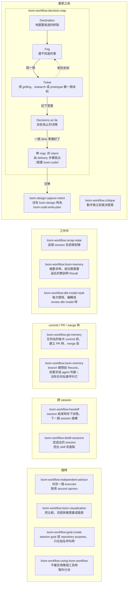

# loom-workflow

Read this in: [English](README.md) | [日本語](README.ja.md) | **繁體中文**

> 適用 Claude Code 與 Codex、圍繞 Loom 各站的 workflow 工具：持久化的 Outcome Map、git memory、repository memory、critique、recap、handoff、session distill、chat 圖表與推理頁，以及 second opinion。

**Version**：5.0.0 ・ **Repository**：[kouko/loom-plugins](https://github.com/kouko/loom-plugins) ・ **License**：MIT

## 這是什麼

Loom 讓一個變更依序走過各站：`loom-design` 整理 intent 與 spec，`loom-code`
負責 plan、build、review、ship。`loom-workflow` 收的是圍繞這些站使用的工具。
工具本身不是站：每個工具都在特定時機接上，或在需要時呼叫，而且每個工具都能直接以名稱呼叫。

每個工具只裝 `loom-workflow` 就能運作。唯一的例外是 `decision-map` 的 delivery
步驟：它依 `loom-code` 的 contract template 寫出 intent，因此需要 `loom-code`；
開地圖與推進 ticket 則不需要。

## 收錄準則（Admission rule）

一個 skill 屬於這裡，條件是它跨站協調工作，或跨 session 攜帶狀態；只是被好幾個
plugin 用到並不算數。`decision-map` 是這條規則的第一個實例。這條規則只 gate
新收錄，plugin 裡既有的 utility skill 維持不動。

## 什麼時候用哪個工具

這不是一條依序執行的流程。工具依使用時機分組；圖中的箭頭只有 `decision-map`
自己的迴圈，以及它交棒給各站的那一步。



- **變更之前** — `decision-map` 用於無法一開始就列出完整路線的工作。Outcome Map
  位於 `docs/loom/maps/<map-id>/`，跨 session 保存。一個 slice 準備好時，delivery
  步驟寫出帶 `map:` 的 intent，交給 `loom-design:capture-intent`（沒有
  `loom-design` 時交給 `loom-code:write-plan`）；此後這個變更由該站負責。`critique`
  在動手做任何東西之前裁決提案。
- **工作中** — `recap-state` 在目前的對話裡幫你重新定向。`loom-memory`
  在被要求時或任務需要時 Recall 過去的教訓。`dbt-model-style` 在每次撰寫、編輯或
  review dbt model 時套用。
- **commit / PR / merge 時** — `git-memory` 在任何站的每次 commit 前、建立 PR
  時，以及 `ship` 之後才進行的 PR merge 之前執行。`loom-memory` 在 branch
  關閉前，依要求或 agent 判斷 Record 持久的教訓；沒有任何站會呼叫它。
- **跨 session** — `handoff` 在 session 結束時存下狀態，並在下一個 session
  接續。`distill-sessions` 從過去的 session 挖出 skill 改進提案。
- **隨時** — `independent-advisor` 向另一個 executor 取得 second opinion，
  `loom-visualization` 把比較、流程與推理呈現成表格或圖（也能做成推理頁），`goal-create` 只在指名呼叫時執行，
  `using-loom-workflow` 在不確定該用哪個工具時分派請求。

## Skills

共 12 個 skills：11 個工具與 1 個可選入口。

| Skill | 角色 |
|---|---|
| [`using-loom-workflow`](skills/using-loom-workflow/) | 可選入口：為廣泛或不明確的請求挑出對應工具，並讀入該工具的指示。每個工具仍可直接呼叫。 |
| [`decision-map`](skills/decision-map/) | 在 `docs/loom/maps/<map-id>/` 開一張持久化的 Outcome Map 並持續推進：Destination、fog、分型的 ticket 與 Decisions-so-far 紀錄；delivery 步驟會寫出 intent。 |
| [`critique`](skills/critique/) | 在動手做之前裁決提案：`mode: proposal` 把清單或計畫分成 KEEP / DEFER / DROP；`mode: complexity` 用 deletion-first 量一個具體改動。 |
| [`recap-state`](skills/recap-state/) | 在 session 內 recap 工作目前的位置，然後停下來等確認。不是內建的 `/recap`（away-summary）。 |
| [`loom-memory`](skills/loom-memory/) | 查詢、記錄、核對或淘汰 commit 進 memory store 的持久 repository 教訓。 |
| [`dbt-model-style`](skills/dbt-model-style/) | 撰寫、編輯或 review dbt model 時，套用 dbt + Redshift 的 style 與 structure（CTE 角色、zero-logic 的 final CTE、命名、註解）；計算邏輯不在範圍內。 |
| [`git-memory`](skills/git-memory/) | 在每次 `git commit`、`gh pr create`、`gh pr merge` 之前分類 Decision、Learning、Gotcha memory；也能找回過去某個 Git 決策的理由。 |
| [`handoff`](skills/handoff/) | 把 session 狀態存成 `.claude/handoffs/` 下的 HANDOFF 檔，或在新 session 中從它接續。 |
| [`distill-sessions`](skills/distill-sessions/) | 挖掘過去的 Claude Code 與 Codex session（可用時加上 `/insights` facets），產出依 skill 排序的 friction 與可審閱的 SKILL.md 提案。 |
| [`independent-advisor`](skills/independent-advisor/) | 對 plan 或決策，向另一個 executor——另一個 model tier、更高的 effort，或另一家廠商——取得 second opinion。花錢或把資料送出本機需經同意。 |
| [`loom-visualization`](skills/loom-visualization/) | 在 coding harness 的 chat 裡，把比較、流程、決策、狀態與推理鏈呈現成讀者 client 真的顯示得出來的表格、ASCII 圖或 Mermaid block；推理頁 mode 把已經存在的推理渲染成自包含頁面。不用於 Obsidian 筆記。 |
| [`goal-create`](skills/goal-create/) | 只在指名呼叫時執行。SESSION 起草四欄 goal condition，在 host 接受時啟用，否則誠實提供復原操作；ARC 起草 repository 的 purpose（`Why` / `Done when`）。 |

Loom 的契約計入其中八個工具。`goal-create` 與 `dbt-model-style` 是 Loom
流程之外的 standalone skill，`loom-memory` 與入口路由則維持在契約之外。

## Repository 結構

```
loom-workflow/
├── .claude-plugin/
│   └── plugin.json
├── .codex-plugin/
│   └── plugin.json
├── docs/                  治理、稽核、遙測與設計筆記
├── hooks/
│   ├── hooks.json         SessionStart 卡片，以及 Write/Edit 後檢查 skill 資料夾結構
│   └── visualization-card loom-visualization 的 SessionStart 觸發卡片
├── scripts/               plugin 層級測試與結構檢查
├── skills/
│   ├── critique/
│   ├── dbt-model-style/
│   ├── decision-map/
│   ├── distill-sessions/
│   ├── git-memory/
│   ├── goal-create/
│   ├── handoff/
│   ├── independent-advisor/
│   ├── loom-memory/
│   ├── loom-visualization/
│   ├── recap-state/
│   └── using-loom-workflow/
├── tests/                 git-memory、loom-memory 與 loom-visualization 的測試
├── CHANGELOG.md
├── README.md
├── README.ja.md
└── README.zh-TW.md        (本檔案)
```

## 安裝

這個 repository 是名為 `loom` 的 plugin marketplace。`loom-workflow` 可以單獨安裝；
只有要用 `decision-map` 的 delivery 步驟時才需要再加裝 `loom-code`。

### Claude Code

```sh
claude plugin marketplace add https://github.com/kouko/loom-plugins.git
claude plugin install loom-workflow@loom
```

### Codex

```sh
codex plugin marketplace add https://github.com/kouko/loom-plugins.git
codex plugin add loom-workflow@loom
```

### Antigravity CLI

從 repo 的 clone 安裝，先裝 `loom-code`：`critique`、`decision-map`、
`distill-sessions` 會參照它。

```bash
git clone https://github.com/kouko/loom-plugins.git
cd loom-plugins
agy plugin install ./loom-code
agy plugin install ./loom-workflow
```

使用時，在專案目錄啟動 `agy` 並以絕對路徑把專案加為 workspace：
`agy --add-dir "$PWD"`（互動）或 `agy --add-dir "$PWD" -p "..."`（print 模式）；
agy 1.2.2 不接受 `.` 這類相對路徑。沒有 `--add-dir` 時，print 模式（`agy -p`）
不會掛上 workspace，loom 的 kickoff defaults 不會載入，agent 也可能在專案外動作；
互動模式也請一併指定。

hook 只在 `agy` CLI 執行，Antigravity 桌面 app 與 IDE 裡不會執行。

## 使用

`loom-workflow` 沒有內附 slash command。用自然語言提出，或直接指名 skill；
`goal-create` 只在指名時執行。例如：

```
「critique 這份 12 項的 plan」         → critique（proposal）
「該不該做這個」/「是不是做過頭了」     → critique（complexity）
「我準備 commit」                      → git-memory
「開地圖」/「推進地圖」                 → decision-map
「wrap up」/「save state」             → handoff
「剛剛講到哪」/「我跟丟了」             → recap-state
「second opinion」/「換一個模型看看」   → independent-advisor
```

## 開發

在 repository 根目錄，於隔離環境中執行完整的 package 測試：

```sh
uv run --isolated --with-requirements requirements-package-tests.lock python scripts/run_package_tests.py --loom-family -q
```

## 來源

- `loom-workflow` 原本在 `monkey-skills` 開發，之後抽出到這個 repository；manifest
  內的 homepage 與 repository URL 仍指向該來源。它以 hard-cut rename 取代了
  `dev-workflow`，因此自訂 reference 請使用 `loom-workflow:<skill>`。
- `loom-memory` 在其獨立 plugin 退役時併入本 plugin。
- `skill-creator-advance`、`skill-refactor`、`skill-tuning`、`skill-judge` 已搬到
  `skill-dev-toolkit`；原始設計理由封存在
  [`docs/skill-evolution-architecture.md`](docs/skill-evolution-architecture.md)。

## License

MIT。見 [LICENSE](https://github.com/kouko/loom-plugins/blob/main/LICENSE)。`critique` 的 `mode: complexity` 源自 joshuadavidthomas
採 MIT 授權的
[`reducing-entropy`](https://github.com/joshuadavidthomas/agent-skills/tree/main/skills/reducing-entropy)，
其 `LICENSE` 與 `NOTICE` 檔保留完整 copyright chain。
