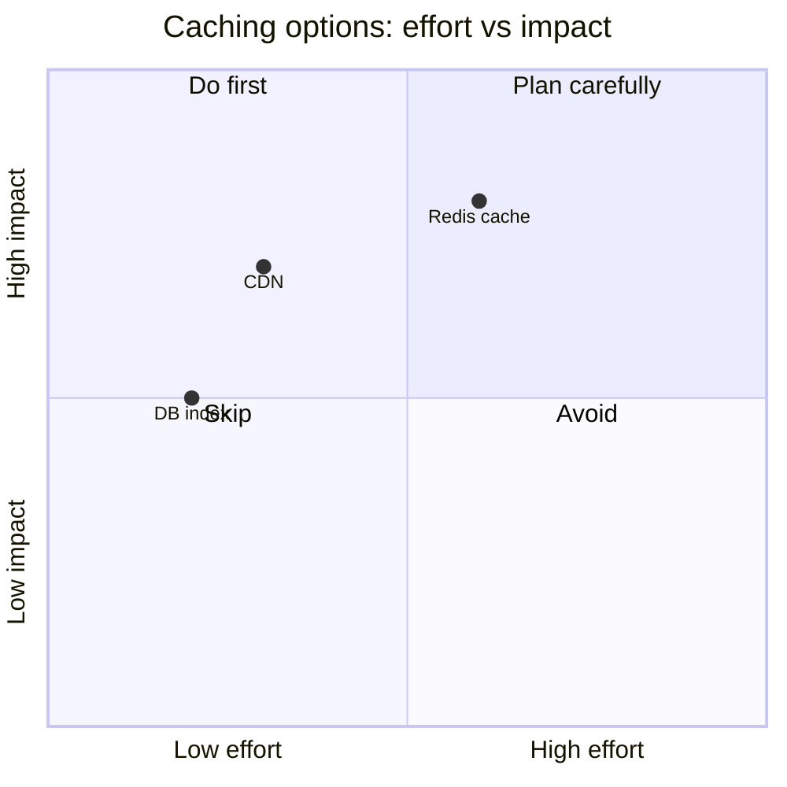

target: coding-harness

# Option comparison

## When to use

Two or more options judged on the same criteria: libraries, designs,
approaches, fixes. The reader has to pick, so every option gets the same
columns and the recommendation is stated after the table, not buried in a cell.

## Table

The default form. One row per option, one column per criterion, short cells.

| 方案 | 延遲 | 維護成本 | 適合 |
|---|---|---|---|
| Redis 快取 | 低 | 中 | 讀多寫少 |
| CDN | 最低 | 低 | 靜態資源 |
| DB index | 中 | 低 | 查詢慢 |

## ASCII

Use when the table must survive a plain-text channel that does not render
markdown. Run `python3 scripts/generate.py table` with this input on stdin:

```json
{"headers": ["方案", "延遲", "維護成本", "適合"], "rows": [
  ["Redis 快取", "低", "中", "讀多寫少"],
  ["CDN", "最低", "低", "靜態資源"],
  ["DB index", "中", "低", "查詢慢"]
]}
```

Output:

```
┌────────────┬──────┬──────────┬──────────┐
│ 方案       │ 延遲 │ 維護成本 │ 適合     │
├────────────┼──────┼──────────┼──────────┤
│ Redis 快取 │ 低   │ 中       │ 讀多寫少 │
│ CDN        │ 最低 │ 低       │ 靜態資源 │
│ DB index   │ 中   │ 低       │ 查詢慢   │
└────────────┴──────┴──────────┴──────────┘
```

## Mermaid

Only where the client check allows Mermaid, and only when two numeric axes
really separate the options; otherwise keep the table.



## Common mistakes

- Different criteria per option, so the rows cannot be compared.
- Long sentences in cells; move the reasoning below the table.
- A quadrant chart with invented coordinates when the criteria are not numeric.
- Emoji or check-mark symbols as cell values in the ASCII form; they break alignment.
