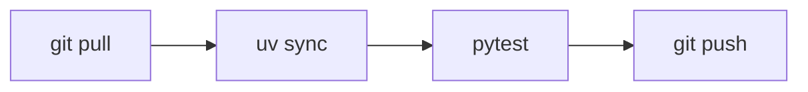

target: coding-harness

# Linear steps

## When to use

Three or more steps that always run in the same order with no branch: a
release procedure, a build pipeline, a setup sequence. If any step can go two
ways, use the branching decision template instead.

## Table

| # | Step | Command | Done when |
|---|---|---|---|
| 1 | Update | `git pull` | branch is current |
| 2 | Install | `uv sync` | lockfile resolved |
| 3 | Test | `pytest` | all tests pass |
| 4 | Publish | `git push` | remote has the commit |

## ASCII

Run `python3 <skill-dir>/scripts/generate.py flow` (`<skill-dir>` is defined
in `SKILL.md`) with this input on stdin:

```json
{"steps": ["git pull", "uv sync", "pytest", "git push"]}
```

Output:

```
┌──────────┐
│ git pull │
└──────────┘
      │
      ▼
┌──────────┐
│ uv sync  │
└──────────┘
      │
      ▼
┌──────────┐
│  pytest  │
└──────────┘
      │
      ▼
┌──────────┐
│ git push │
└──────────┘
```

## Mermaid



## Common mistakes

- Drawing a flow for two steps; a sentence is clearer.
- Hiding a condition inside a step label ("test, and if it fails, fix").
- Writing `->` instead of `-->` in Mermaid; it does not parse.
- Hand-padding the ASCII boxes instead of using the generator.
