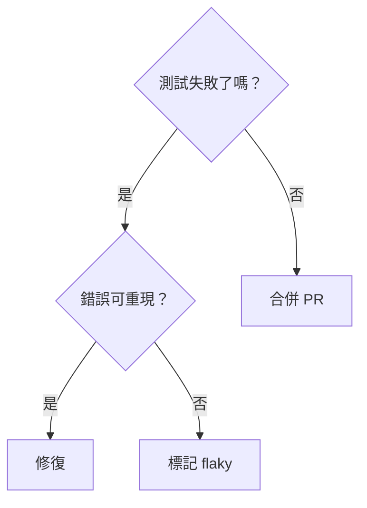

target: coding-harness

# Branching decision

## When to use

A question whose answer sends the work down different paths: triage, a
rollback decision, which fix to apply. Every branch ends in an action.

## Table

| 條件 | 答案 | 下一步 |
|---|---|---|
| 測試失敗了嗎？ | 否 | 合併 PR |
| 測試失敗了嗎？ | 是 | 檢查錯誤可重現 |
| 錯誤可重現？ | 是 | 修復 |
| 錯誤可重現？ | 否 | 標記 flaky |

## ASCII

No generator covers branches. Hand-author the diagram, then verify it with
`python3 <skill-dir>/scripts/align.py -` (`<skill-dir>` is defined in
`SKILL.md`) until it prints no drift.

```
         ┌──────────────────┐
         │ 測試失敗了嗎？   │
         └────┬────────┬────┘
              │        │
             是        否
              │        │
              ▼        ▼
┌──────────────┐  ┌──────────────┐
│ 錯誤可重現？ │  │ 合併 PR      │
└──┬───────┬───┘  └──────────────┘
   │       │
  是       否
   │       │
   ▼       ▼
┌──────┐ ┌────────────┐
│ 修復 │ │ 標記 flaky │
└──────┘ └────────────┘
```

## Mermaid



## Common mistakes

- Unlabelled branch edges; the reader cannot tell which answer leads where.
- A branch that ends without an action.
- Padding CJK labels by character count; each CJK character takes two cells.
- Unquoted Mermaid labels containing `?`, `(` or `/`.
