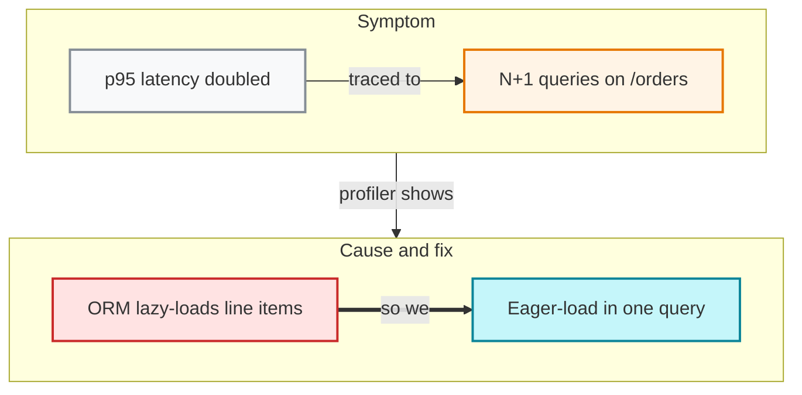

target: coding-harness

# Reasoning chain

## When to use

A conclusion reached through a chain of causes or inferences: a root-cause
analysis, why a design was chosen. Each edge says why the next state follows.
For a standalone page explaining documented reasoning, use page mode instead.

## Table

| Step | Claim | Why the next step follows |
|---|---|---|
| 1 | p95 latency doubled | the profiler traced it to one endpoint |
| 2 | N+1 queries on /orders | each order row loads its items separately |
| 3 | ORM lazy-loads line items | the fix must remove the per-row load |
| 4 | Eager-load in one query | conclusion |

## ASCII

No generator covers labelled edges. Hand-author the chain, then verify it with
`python3 scripts/align.py -`.

```
┌───────────────────────────┐
│ p95 latency doubled       │
└─────────────┬─────────────┘
              │ because
              ▼
┌───────────────────────────┐
│ N+1 queries on /orders    │
└─────────────┬─────────────┘
              │ because
              ▼
┌───────────────────────────┐
│ ORM lazy-loads line items │
└─────────────┬─────────────┘
              │ so
              ▼
┌───────────────────────────┐
│ eager-load in one query   │
└───────────────────────────┘
```

## Mermaid

Follows the row convention of `references/mermaid-cot-spec.md`: rows are
subgraphs with their own `direction LR`, rows join subgraph to subgraph,
every edge is labelled, and `==>` marks the step into the conclusion.



## Common mistakes

- Empty edge labels such as "then" or "so" with no reason.
- A node edge that crosses rows; Mermaid then drops the row layout.
- Treating a topic heading as a node; a node carries a claim.
- Leaving out the step that was overturned; a reversal belongs in the chain.
