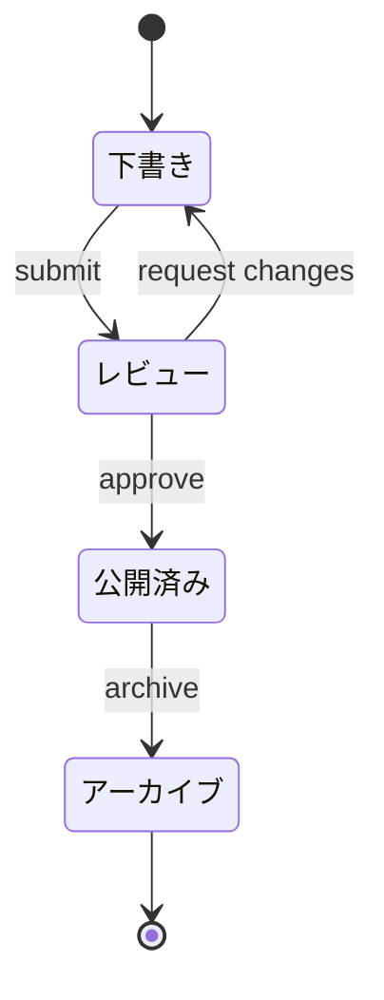

target: coding-harness

# State lifecycle

## When to use

Something that moves between named states through named events: an order, a
pull request, a job, a document. The events on the arrows matter as much as
the states.

## Table

| From | Event | To |
|---|---|---|
| 下書き | submit | レビュー |
| レビュー | request changes | 下書き |
| レビュー | approve | 公開済み |
| 公開済み | archive | アーカイブ |

## ASCII

No generator covers states. Hand-author the diagram, then verify it with
`python3 scripts/align.py -`.

```
┌──────────┐  submit   ┌──────────┐  approve  ┌──────────┐
│ 下書き   ├──────────►│ レビュー ├──────────►│ 公開済み │
└──────────┘           └────┬─────┘           └────┬─────┘
     ▲                      │                      │
     │      request changes │                      │ archive
     └──────────────────────┘                      ▼
                                            ┌────────────┐
                                            │ アーカイブ │
                                            └────────────┘
```

## Mermaid



## Common mistakes

- Transitions with no event name.
- CJK text used directly as a state id; declare `state "..." as Id` first.
- Mixing states with actions ("sending") and outcomes ("sent") in one diagram.
- Forgetting the loop back when a state can be re-entered.
