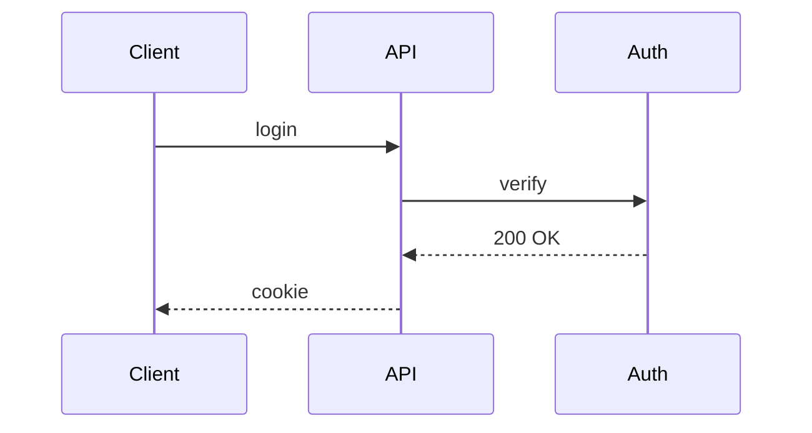

target: coding-harness

# Actor sequence

## When to use

Several actors or services exchanging messages in order: an auth handshake, a
webhook round-trip, a request crossing services. Order in time is the point.

## Table

| # | From | To | Message |
|---|---|---|---|
| 1 | Client | API | login |
| 2 | API | Auth | verify |
| 3 | Auth | API | 200 OK |
| 4 | API | Client | cookie |

## ASCII

Run `python3 <skill-dir>/scripts/generate.py seq` (`<skill-dir>` is defined
in `SKILL.md`) with this input on stdin. The generator
is correct by construction; lifelines outside a message's span are left blank
on purpose, so do not hand-edit its output.

```json
{"participants": ["Client", "API", "Auth"], "messages": [{"from": "Client", "to": "API", "label": "login"}, {"from": "API", "to": "Auth", "label": "verify"}, {"from": "Auth", "to": "API", "label": "200 OK"}, {"from": "API", "to": "Client", "label": "cookie"}]}
```

Output:

```
┌────────┐   ┌─────┐   ┌──────┐
│ Client │   │ API │   │ Auth │
└────┬───┘   └──┬──┘   └───┬──┘
     │          │          │
     │          │          │
     │  login   │          │
     │──────────►
     │          │ verify   │
                │──────────►
     │          │ 200 OK   │
                ◄──────────│
     │  cookie  │          │
     ◄──────────│
```

## Mermaid



## Common mistakes

- Message labels longer than the gap between lifelines; keep them short.
- A self-message in the ASCII generator; it is rejected, so describe it in prose.
- Using a sequence for steps that involve only one actor; use linear steps.
- Mixing request and response arrows; use `->>` for calls and `-->>` for replies.
