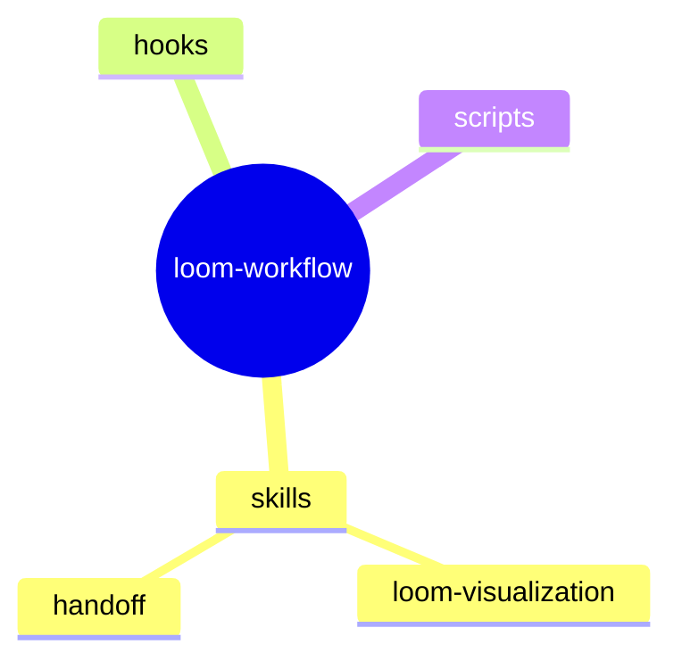

target: coding-harness

# Hierarchy

## When to use

A parent-child structure with no cross-links: a directory tree, a module
breakdown, a taxonomy. If children point at each other, use system
architecture instead.

## Table

| Parent | Child | Role |
|---|---|---|
| loom-workflow | skills | skill folders |
| skills | loom-visualization | this skill |
| skills | handoff | session state |
| loom-workflow | hooks | session hooks |
| loom-workflow | scripts | package tests |

## ASCII

Run `python3 scripts/generate.py tree` with this input on stdin:

```json
{"node": {"label": "loom-workflow", "children": [{"label": "skills", "children": [{"label": "loom-visualization"}, {"label": "handoff"}]}, {"label": "hooks"}, {"label": "scripts"}]}}
```

Output:

```
loom-workflow
├─ skills
│  ├─ loom-visualization
│  └─ handoff
├─ hooks
└─ scripts
```

## Mermaid



## Common mistakes

- More than four levels; split the tree or collapse a level.
- Wrong indentation in a Mermaid mindmap; depth is read from indentation alone.
- Drawing a hierarchy as boxes and arrows; the tree form is shorter and aligns by construction.
- Mixing items of different kinds (files and people) at one level.
