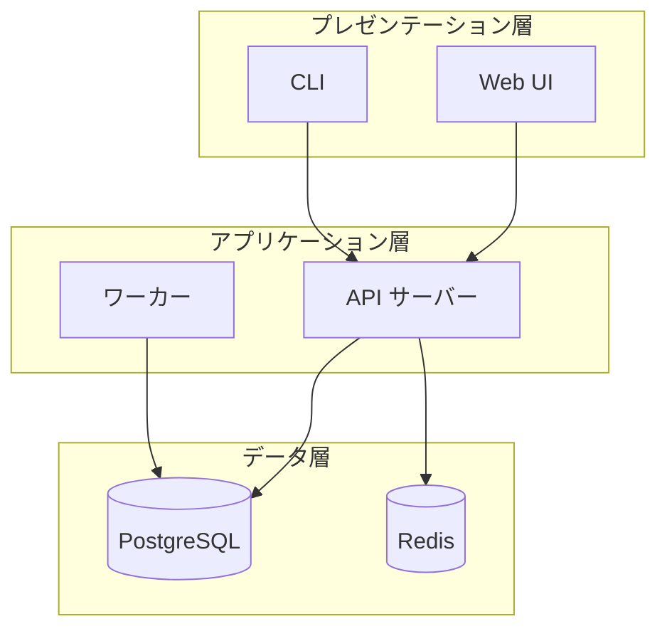

target: coding-harness

# System architecture

## When to use

Components grouped into layers or boundaries, with dependencies between them.
Draw one C4 level per diagram: context (systems and people), container
(deployable parts) or component (parts inside one container). Never mix levels.

## Table

| 層 | コンポーネント | 依存先 |
|---|---|---|
| プレゼンテーション層 | Web UI | API サーバー |
| プレゼンテーション層 | CLI | API サーバー |
| アプリケーション層 | API サーバー | PostgreSQL, Redis |
| アプリケーション層 | ワーカー | PostgreSQL |
| データ層 | PostgreSQL | — |
| データ層 | Redis | — |

## ASCII

A reply defaults to the table above; draw this when the shape itself is the
information, or when the destination does not render markdown.

Run `python3 <skill-dir>/scripts/generate.py arch` (`<skill-dir>` is defined
in `SKILL.md`) with this input on stdin. The layer
bands carry no arrows; state the dependencies in the table or below the diagram.

```json
{"layers": [{"name": "プレゼンテーション層", "components": ["Web UI", "CLI"]}, {"name": "アプリケーション層", "components": ["API サーバー", "ワーカー"]}, {"name": "データ層", "components": ["PostgreSQL", "Redis"]}]}
```

Output:

```
┌─────────────────────────┐
│  プレゼンテーション層   │
├─────────────┬───────────┤
│ Web UI      │ CLI       │
└─────────────┴───────────┘
┌─────────────────────────┐
│   アプリケーション層    │
├──────────────┬──────────┤
│ API サーバー │ ワーカー │
└──────────────┴──────────┘
┌─────────────────────────┐
│        データ層         │
├──────────────┬──────────┤
│ PostgreSQL   │ Redis    │
└──────────────┴──────────┘
```

## Mermaid

Container level: one subgraph per layer.



## Common mistakes

- Mixing C4 levels, such as a whole external system next to one class.
- Arrows with no direction of dependency agreed; point from caller to callee.
- Using `end` or a bare single letter that collides with a subgraph as a node id.
- Pictographic icons in layer names; they break the ASCII widths.
