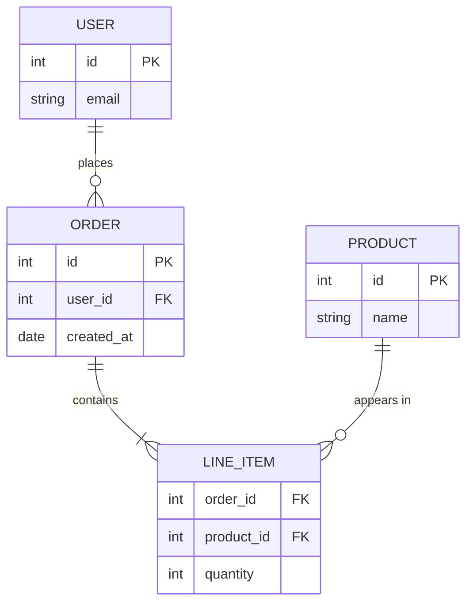

target: coding-harness

# Data model

## When to use

Entities, their fields and the relations between them: a schema change, an ORM
model, an API resource shape. Cardinality matters as much as the field list.

## Table

| Entity | Field | Type | Key | Relation |
|---|---|---|---|---|
| USER | id | int | PK | has many ORDER |
| USER | email | string | | |
| ORDER | id | int | PK | has many LINE_ITEM |
| ORDER | user_id | int | FK | belongs to USER |
| LINE_ITEM | order_id | int | FK | belongs to ORDER |
| LINE_ITEM | product_id | int | FK | belongs to PRODUCT |
| LINE_ITEM | quantity | int | | |
| PRODUCT | id | int | PK | appears in many LINE_ITEM |

## ASCII

No faithful ASCII form: crow's-foot cardinality and field lists do not survive
box drawing. Use the table substitute above, one row per field with its key and
relation, and add one sentence per relation when cardinality is the point.

## Mermaid

## Common mistakes

- Drawing entities as ASCII boxes with arrows; cardinality gets lost.
- A relation label with spaces left unquoted in Mermaid.
- Listing every column; show the keys and the fields the change touches.
- Omitting which side is optional (`o`) and which is required (`|`).
