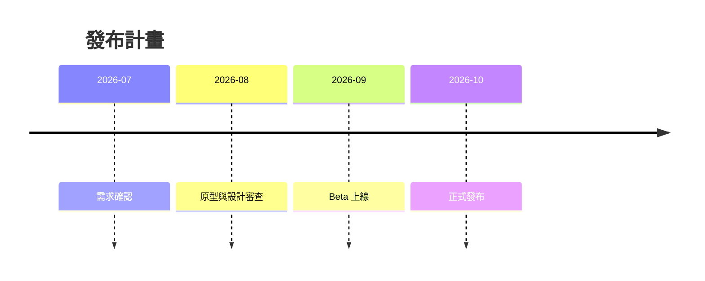

target: coding-harness

# Timeline

## When to use

Events placed on dates or periods: a release plan, an incident timeline, a
migration schedule. Use a timeline when the dates matter; for order alone, use
linear steps.

## Table

| 期間 | 事件 |
|---|---|
| 2026-07 | 需求確認 |
| 2026-08 | 原型與設計審查 |
| 2026-09 | Beta 上線 |
| 2026-10 | 正式發布 |

## ASCII

No generator covers timelines. Hand-author it, keeping the dates in one column,
then verify it with `python3 scripts/align.py -`.

```
2026-07 ──┬── 需求確認
          │
2026-08 ──┼── 原型與設計審查
          │
2026-09 ──┼── Beta 上線
          │
2026-10 ──┴── 正式發布
```

## Mermaid



## Common mistakes

- Dates in mixed formats; pick one and keep the column width fixed.
- Relative dates ("next week") that go stale; write absolute dates.
- A colon inside an event text in Mermaid; it starts a new event.
- Using a Gantt chart when durations and dependencies were never asked for.
