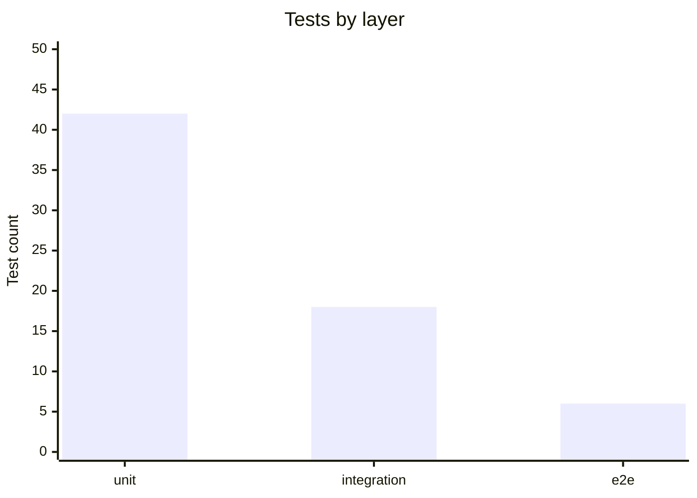

target: coding-harness

# Quantity

## When to use

A few labelled numbers whose relative size is the message: test counts per
layer, bundle size per package, latency per endpoint. Always print the number
next to the bar.

## Table

| Layer | Tests |
|---|---|
| unit | 42 |
| integration | 18 |
| e2e | 6 |

## ASCII

A reply defaults to the table above; draw this when the shape itself is the
information, or when the destination does not render markdown.

Run `python3 <skill-dir>/scripts/generate.py bar` (`<skill-dir>` is defined
in `SKILL.md`) with this input on stdin:

```json
{"pairs": [
  ["unit", 42],
  ["integration", 18],
  ["e2e", 6]
], "width": 20}
```

Output:

```
unit        ████████████████████ 42
integration █████████ 18
e2e         ███ 6
```

## Mermaid



## Common mistakes

- Bars without the numbers; the reader cannot read exact values.
- Mixing units (ms and s) in one chart.
- A chart for two numbers; a sentence is enough.
- Emoji as bar characters; their width varies between terminals.
